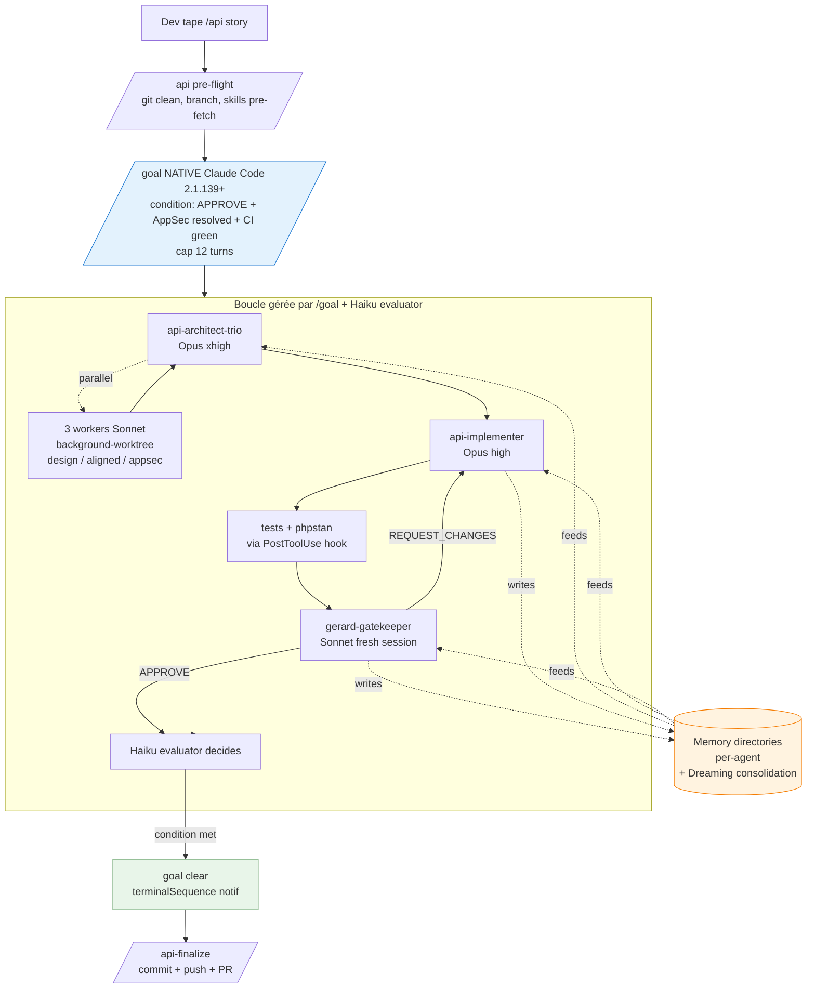

<div align="center">

# gerard — Superpowers API Platform

**A Claude Code plugin that turns one story into a reviewed PR for API Platform 4.3 / Symfony 7.4+.**

3 specialized agents · 5 deterministic hooks · 53 doctrinal skills · multi-model orchestration · per-agent memory.

[](LICENSE)
[](RELEASE-NOTES.md)
[](https://code.claude.com/docs/en/changelog.md)
[](https://api-platform.com)
[](https://symfony.com)
[](https://php.net)

</div>

---

## Quick start

```bash
# 1. Add the marketplace
/plugin marketplace add gerard-labs/superpowers-api-platform

# 2. Install the plugin
/plugin install gerard@superpowers-api-platform

# 3. Ship a story
/api "Add a Product resource with name, price and a BackedEnum status (DRAFT|PUBLISHED|ARCHIVED)"
```

`/api` orchestrates architecture → implementation → adversarial review until a gatekeeper-issued `VERDICT: APPROVE`. When the goal clears, run `/api-finalize` to commit + push + open a PR.

---

## How it works



Three agents collaborate behind a single user-facing command. The native `/goal` loop drives them until a verifiable condition (gatekeeper APPROVE + AppSec H1/H2 zero + tests green + hook-clean) is met. See [`docs/how-it-works.md`](docs/how-it-works.md) for the full walkthrough.

---

## What you get

| | Feature | Detail |
|---|---|---|
| 🤖 | **3 specialized agents** | `api-architect-trio` (Opus xhigh, dispatches 3 Sonnet workers in parallel), `api-implementer` (Opus high), `gerard-gatekeeper` (Sonnet, fresh-session adversarial). See [`docs/agents.md`](docs/agents.md). |
| 🪝 | **5 deterministic hooks** | Session-start env detection, prompt-time skill pre-fetch, secret-file write block, PHP regex + PHPStan post-write, desktop notification on stop. See [`docs/hooks.md`](docs/hooks.md). |
| 📚 | **53 doctrinal skills** | 20 API Platform 4.3 + 6 Doctrine + 6 Symfony async/voters/cache/rate-limit + 7 architecture + 4 testing + 8 workflow + 2 meta. See [`docs/skills.md`](docs/skills.md). |
| ⚡ | **Multi-model orchestration** | Opus 4.7 for architecture lead and implementation, Sonnet 4.6 for workers and gatekeeper, Haiku 4.5 for `/goal` evaluation. ~30-40% fewer tokens than all-Opus. |
| 🧠 | **Memory + Dreaming** | Each agent reads and writes its own `memory/` dir. Findings accumulate across runs; Dreaming consolidates between sessions. See [`docs/forensic-loop.md`](docs/forensic-loop.md). |
| 🎯 | **Native `/goal` loop** | No bespoke state-file protocol. The Claude Code 2.1.139+ `/goal` primitive drives the loop with a verifiable condition and an automatic Haiku evaluator. |
| 🛡️ | **Anti-patterns enforcement** | 24 base rules (16 API Platform 4.3 + 8 Symfony 7.4+) auto-rejected by the gatekeeper, plus tests + AppSec extensions = 39 total. The PostToolUse hook catches the top 7 inline. See [`docs/anti-patterns.md`](docs/anti-patterns.md). |
| 🚀 | **-80% coordinator code** | vs v0.1 (no state files, no marker protocol, no REQUEST_CHANGES hard-coded loop). `/goal` + multi-model agents do the orchestration natively. |

---

## The 3 agents

| Agent | Stage | Model | Role |
|---|---|---|---|
| `api-architect-trio` | Architecture | Opus 4.7 xhigh | Reads memory, classifies story, dispatches 3 background workers (design + aligned-KISS + appsec) in parallel via worktree isolation, synthesizes plan preserving Aligned and AppSec blocks verbatim. |
| `api-implementer` | Dev | Opus 4.7 high | Reads memory, implements plan + tests + AppSec mitigations, iterates phpstan / phpunit until green, returns DoD report with Y/N anti-pattern checklist. |
| `gerard-gatekeeper` | Review | Sonnet 4.6 | Fresh-session adversarial reviewer. 39-rule checklist. EVIDENCE block, cap unverified claims, skill-dispatch theatre detection. Returns `VERDICT: APPROVE` or `REQUEST_CHANGES` as the first line. |

Full reference: [`docs/agents.md`](docs/agents.md).

---

## The 5 hooks

| Event | Hook | Job |
|---|---|---|
| `SessionStart` | `session-start.sh` | Detect Symfony / API Platform versions, runner type (DDEV / Make / FrankenPHP / Compose / host), test framework. Warn if Claude Code < 2.1.139. Emit env JSON. |
| `UserPromptSubmit` | `user-prompt-submit.sh` | If prompt starts with `/api`, parse keywords → inject a `additionalContext` system reminder listing the relevant `gerard:*` skills to pre-fetch. |
| `PreToolUse` (`Write`\|`Edit`\|`MultiEdit`) | `pre-tool-use.sh` | Deny writes to secret-shaped filenames (`.env*`, `*.pem`, `*.key`, `*credentials*`, `*.p12`, `*.pfx`, ssh keys, `*.kdbx`). |
| `PostToolUse` (`Write`\|`Edit`\|`MultiEdit`) | `post-tool-use.sh` | On `*.php` files: 7 fast-feedback regexes (debug calls, TODOs, `mixed`, legacy 3.x annotation, manual default ops, hard-coded localhost) + PHPStan (30s timeout). Block with reason if any hit. |
| `Stop` | `stop.sh` | Minimal scope. Emit `terminalSequence` desktop notification — `gerard: goal cleared on <branch>. Run /api-finalize to commit + PR.` |

Full reference: [`docs/hooks.md`](docs/hooks.md).

---

## A taste of the skills

The 53 skills are organized by domain. Top-10 by likely-trigger frequency :

| Skill | Scope |
|---|---|
| `gerard:api-platform-resources` | `#[ApiResource]`, operations, IRI-only relations, content negotiation. |
| `gerard:api-platform-filters` | Modern `parameters: [QueryParameter]` pattern (Exact / Iri / Uuid / Partial / Sort / FreeText / Or / Exists / BackedEnum). |
| `gerard:api-platform-security` | Operation security, voters, JWT/OIDC, CORS, property security. |
| `gerard:api-platform-tests` | `ApiTestCase`, DAMA, Foundry, JWT clients, schema assertions. |
| `gerard:api-platform-errors` | RFC 7807, `#[ErrorResource]`, exceptionToStatus. |
| `gerard:api-platform-identifiers` | UUID v7, ULID, composite identifiers, `UriVariableTransformer`. |
| `gerard:tdd-php` | RED-GREEN-REFACTOR with Pest *or* PHPUnit (routed by `test_framework` from session-start). |
| `gerard:doctrine-migrations` | Schema versioning, zero-downtime patterns. |
| `gerard:symfony-voters` | Voter pattern, isolated tests. |
| `gerard:meta/anti-patterns-audit` | Standalone audit of the current diff against the 24-rule checklist. |

Full catalog (53 skills, table by domain): [`docs/skills.md`](docs/skills.md).

---

## Commands

| Command | Description |
|---|---|
| [`/api <story>`](docs/commands.md#api) | Implement a story end-to-end via architect-trio → implementer → gatekeeper, driven by native `/goal`. Flags: `--interactive`, `--effort low\|high\|xhigh`. |
| [`/api-finalize`](docs/commands.md#api-finalize) | After goal-clear : compose commit message, stage explicitly (skip secrets / legacy state files), commit, push, open a PR. Flags: `--no-push`, `--no-pr`. |
| [`/api-doctrine`](docs/commands.md#api-doctrine) | Export / import / list snapshots of the three agents' memory dirs (M3 hybrid auto-memory strategy). Sub-commands: `export <name>`, `import <name>`, `list`. |

---

## Installation

### From the marketplace

```bash
/plugin marketplace add gerard-labs/superpowers-api-platform
/plugin install gerard@superpowers-api-platform
```

### For your team (project-scoped)

Add to your project's `.claude/settings.json`:

```json
{
  "extraKnownMarketplaces": {
    "superpowers-api-platform": {
      "source": {
        "source": "github",
        "repo": "gerard-labs/superpowers-api-platform"
      }
    }
  },
  "enabledPlugins": {
    "gerard@superpowers-api-platform": true
  }
}
```

> **Heads-up**: the plugin uses Claude Code 2.1.139+ primitives (`/goal`, `Monitor`, `Agent` with `isolation: "worktree"`). The session-start hook warns if your Claude Code version is older.

---

## Walkthrough — a typical run

```text
$ /api "Add a Product resource with name, price and BackedEnum status"

gerard: pre-flight OK — branch api/add-product-resource, tree clean
gerard: detected shape = new-resource, effort = high, interactive = false
gerard: composing /goal with new-resource addendum
gerard: dispatching api-architect-trio (Opus xhigh) …
        → 3 background workers (design / aligned / appsec) — Sonnet 4.6 — running
        → architect synthesis: plan preserves Aligned-Reviewer + AppSec blocks verbatim
gerard: dispatching api-implementer (Opus high) …
        → reading agents/api-implementer/memory/
        → creating src/ApiResource/Product.php, src/Entity/Product.php, tests/…
        → post-tool-use hook: phpstan OK on each edit
gerard: dispatching gerard-gatekeeper (Sonnet 4.6, fresh session) …
        → VERDICT: APPROVE
        → AppSec bilan: H1 resolved, H2 resolved
gerard: goal cleared on api/add-product-resource. Run /api-finalize to commit + PR.
[BEL]  desktop notification: goal cleared
```

---

## Documentation

- [`docs/overview.md`](docs/overview.md) — 5-minute read to grasp the whole plugin
- [`docs/how-it-works.md`](docs/how-it-works.md) — Architecture deep-dive (mermaid sequences, multi-model rationale)
- [`docs/agents.md`](docs/agents.md) — The 3 agents in detail (I/O, memory pattern, model rationale)
- [`docs/hooks.md`](docs/hooks.md) — The 5 hooks (trigger, job, examples, override patterns)
- [`docs/commands.md`](docs/commands.md) — Full reference for `/api`, `/api-finalize`, `/api-doctrine`
- [`docs/skills.md`](docs/skills.md) — Catalog of the 53 skills (table by domain)
- [`docs/anti-patterns.md`](docs/anti-patterns.md) — The 24 canonical anti-patterns (source of truth)
- [`docs/goal-patterns.md`](docs/goal-patterns.md) — `/goal` condition templates (8 shapes + generic)
- [`docs/forensic-loop.md`](docs/forensic-loop.md) — Memory accumulation, Dreaming consolidation, snapshot sharing
- [`docs/migration-v0.1.md`](docs/migration-v0.1.md) — Migrating from v0.1 (mapping commands, FAQ)
- [`docs/troubleshooting.md`](docs/troubleshooting.md) — Common errors and how to debug them

---

## Supported versions

| Framework | Version | Status |
|---|---|---|
| Claude Code | **2.1.139+** | Required (native `/goal`, `Monitor`, worktree isolation) |
| API Platform | **4.3+** | Required |
| Symfony | **7.4 LTS** (released Nov 2025) | Required |
| Symfony | **8.0+** | Supported |
| PHP | **8.2+** | Required |

Older versions are out of scope. The session hook warns and points to `gerard:api-platform-upgrade` for migration.

---

## Migrating from v0.1

v1.0 is a **big bang rebuild** — 25 commands collapsed into 3, 7 agents into 3, 1 hook into 5, and the bespoke state-file orchestration replaced by native `/goal`. See [`docs/migration-v0.1.md`](docs/migration-v0.1.md) for the full mapping and walkthrough.

---

## Contributing

See [`CONTRIBUTING.md`](CONTRIBUTING.md). The validator (`scripts/validate_skills.ts`) and lint (`scripts/lint_skill_content.ts`) gate every PR.

---

## License

MIT — see [`LICENSE`](LICENSE).

---

## Support

- Issues: [github.com/gerard-labs/superpowers-api-platform/issues](https://github.com/gerard-labs/superpowers-api-platform/issues)
- Discussions: [github.com/gerard-labs/superpowers-api-platform/discussions](https://github.com/gerard-labs/superpowers-api-platform/discussions)
