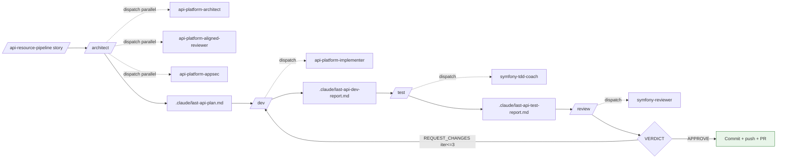

# Superpowers API Platform

A Claude Code plugin focused on **API Platform 4.3+** running on **Symfony 7.4 LTS+**. Provides specialized skills, agents, slash commands, a session hook, **and a full agentic pipeline** (architect → dev → test → review with REQUEST_CHANGES loop) to scaffold and review resources, DTOs, state providers/processors, modern filters (`parameters` + `QueryParameter`), security (JWT/OIDC/CORS), MCP, Object Mapper, Resource/Operation Mutators, Scalar UI, ErrorResource, identifiers (UUID v7 / ULID), resilience patterns, performance tuning, and exhaustive tests.

## Pipeline at a glance



Full architecture: [`docs/symfony/pipeline-overview.md`](docs/symfony/pipeline-overview.md).

## Highlights

- **API Platform 4.3 only** — no `#[ApiFilter]`, no `openapiContext`, no `hydra:` prefix, no `AbstractFilter`. The plugin targets the modern pattern (`parameters: [new QueryParameter(filter: new ExactFilter(), property: 'sku')]`) and the 4.3 novelties (MCP, Object Mapper, Scalar, Mutators, `UuidFilter`, `ComparisonFilter::ne`, `caseSensitive` partial search, native `castToNativeType`/`castToArray`/`castFn`).
- **Symfony 7.4 LTS / 8.0+ only** — current LTS and the latest stable. Older versions are intentionally out of scope.
- **Full agentic pipeline** — `/api-resource-pipeline` (semi-auto) and `/api-resource-ship` (full autonomy with commit + push + PR) chain the 4 stages with state files (`.claude/last-api-*.md`), REQUEST_CHANGES loop (cap 3), strict verdict format, marker protocol.
- **7 specialized agents** — 3 architecture personas dispatched in parallel (architect + aligned-reviewer + appsec) + implementer + tdd-coach + reviewer (gatekeeper with 24+ anti-patterns checklist embedded) + doctrine-architect (utility).
- **One skill per topic** — each skill covers one focused area of API Platform 4.3 (resources, dto-resources, state-providers, state-processors, serialization, security, filters, tests, versioning, pagination, performance, resilience, errors, identifiers, openapi, mcp, mutators, user, file-upload, upgrade). See [`skills-map.md`](skills-map.md) for the full index.
- **Project skills layer** — projects can add `.claude/skills/<project-name>/*.md` that **override** the plugin canon (`<project>:X` takes priority over `gerard:X` when both exist). See [`docs/symfony/project-skills-pattern.md`](docs/symfony/project-skills-pattern.md).
- **Session hook** — detects Symfony, API Platform, the orchestration root (Make / DDEV / Docker / host) — including monorepos where Symfony lives in a sub-dir — and the test framework on session start. Warns explicitly if API Platform < 4.3 or Symfony < 7.4 is detected (and points to the `api-platform-upgrade` skill). Surfaces `commands.runner_type`, `commands.console`, `commands.test`, `commands.ci`, `commands.migrations` so agents prefix invocations correctly.
- **Anti-regression lint** — the validator rejects any pre-4.3 pattern outside of the dedicated upgrade skill.
- **Forensic loop documented** — pattern "ship → measure → tighten persona with explicit forbids" with [`docs/symfony/forensic-audit-template.md`](docs/symfony/forensic-audit-template.md).

## Installation

### From the marketplace

```bash
# Add the marketplace
/plugin marketplace add gerard-labs/superpowers-api-platform

# Install the plugin
/plugin install gerard@superpowers-api-platform
```

### For your team (project-scoped)

Add to your project's `.claude/settings.json`:

```json
{
  "extraKnownMarketplaces": {
    "superpowers-api-platform": {
      "source": {
        "source": "github",
        "repo": "gerard-labs/superpowers-api-platform"
      }
    }
  },
  "enabledPlugins": {
    "gerard@superpowers-api-platform": true
  }
}
```

## Usage

Skills are auto-discovered. Claude invokes them based on task context, or call them explicitly with `/<skill-name>`.

### Pipeline commands

```
/architect <story>             # Architecture stage : dispatches architect + aligned + appsec
/dev                           # Dev stage : implementer reads .claude/last-api-plan.md
/test                          # Test stage : tdd-coach validates AC matrix
/review                        # Review stage : gatekeeper emits VERDICT (24+ rules)
/api-resource-pipeline <story> # Chain 4 stages, STOP before commit, REQUEST_CHANGES loop cap 3
/api-resource-ship <story>     # Full autonomy: branch + pipeline + commit + push + PR
/self-audit-api                # Manual Y/N audit of current diff against anti-patterns
```

### Atomic commands (hors pipeline)

```
/symfony-api-resources       # create / evolve a #[ApiResource] (4.3 patterns)
/symfony-api-filters         # parameters + QueryParameter (no #[ApiFilter])
/symfony-api-mcp             # expose API operations as MCP tools (4.3 @experimental)
/symfony-api-mutators        # AsResourceMutator / AsOperationMutator
/symfony-api-errors          # RFC 7807 + #[ErrorResource]
/symfony-api-upgrade         # migrate a 3.x or 4.0-4.2 project to 4.3
/brainstorm                  # pre-architecture brainstorming (upstream of /architect)
/write-plan                  # hors-pipeline implementation plan
/execute-plan                # hors-pipeline checkpoint execution
/symfony-check               # quality gates (PHP-CS-Fixer / PHPStan / tests)
```

## Skills

### API Platform 4.3 (19)

| Skill | Scope |
|-------|-------|
| `api-platform-resources` | `#[ApiResource]`, operations, IRI-only, subresources, content negotiation |
| `api-platform-dto-resources` | Input/Output DTOs + **Object Mapper 4.3** (`#[Map]`) |
| `api-platform-state-providers` | Providers, decorators, header-versioned providers |
| `api-platform-state-processors` | Processors, native Messenger mode (`messenger: 'input'`), CQRS bus |
| `api-platform-serialization` | Groups, `#[Context]`, MaxDepth, BackedEnum, context builder, `gen_id` |
| `api-platform-security` | Operations security, voters, property security, JWT/OIDC, CORS |
| `api-platform-filters` | `parameters` + `QueryParameter` (Exact / Iri / Uuid / Partial / Comparison / Sort / FreeText / Or / Exists / BackedEnum / Property / Sparse), Parameter Providers |
| `api-platform-tests` | ApiTestCase, DAMA, Foundry, ParaTest, schema assertions, JWT clients |
| `api-platform-versioning` | URI / DTO / header versioning, deprecation, Sunset, Rector |
| `api-platform-pagination` | Page / partial / cursor (UUID v7 / ULID) |
| `api-platform-performance` | Eager loading trap, FrankenPHP worker, cache tags, ETag |
| `api-platform-resilience` | Circuit breaker, async writes, degraded mode |
| `api-platform-errors` | RFC 7807, `#[ErrorResource]`, exception → status |
| `api-platform-identifiers` | UUID v7, ULID, composite, `UriVariableTransformer` |
| `api-platform-openapi` | Spec, Swagger UI, ReDoc, **Scalar UI 4.3** |
| `api-platform-mcp` | Expose API as MCP tools (4.3 @experimental) |
| `api-platform-mutators` | `#[AsResourceMutator]` / `#[AsOperationMutator]` (4.3) |
| `api-platform-user` | User entity, password hashing, `/me` |
| `api-platform-file-upload` | VichUploader, multipart, MediaObject |
| `api-platform-upgrade` | Migrate 3.x / 4.0-4.2 to 4.3 (with Rector pointers) |

### Symfony 7.4+ core

| Skill | Scope |
|-------|-------|
| `symfony-messenger` | Async handling, transports, middleware, retry strategies |
| `messenger-retry-failures` | Exponential backoff, dead letter queues |
| `symfony-scheduler` | Recurring tasks, schedule triggers |
| `symfony-voters` | Granular authorization, voter testing |
| `rate-limiting` | Sliding / fixed window / token bucket + Provider decorator |
| `symfony-cache` | Pools, cache tags, HTTP cache |
| `controller-cleanup` | Thin controllers, delegating to services / processors |
| `interfaces-and-autowiring` | DI, binding, decoration, tagged services |
| `ports-and-adapters` | Hexagonal + bounded contexts + Deptrac |
| `cqrs-and-handlers` | Command/Query separation with Messenger |
| `value-objects-and-dtos` | Immutable VOs, BackedEnum, DTO patterns |
| `config-env-parameters` | `.env`, secrets, parameters, env-specific config |
| `strategy-pattern` | Tagged services for runtime algorithm selection |
| `doctrine-relations` | Relationships, fetch modes, cascade, orphan removal |
| `doctrine-migrations` | Versioned schema changes, zero-downtime patterns |
| `doctrine-fixtures-foundry` | Foundry factories, states, sequences |
| `doctrine-transactions` | UnitOfWork, optimistic locking, flush strategies |
| `doctrine-fetch-modes` | Lazy / extra lazy / partial fetch, query hints |
| `doctrine-batch-processing` | Large-volume iteration with `clear()` |
| `tdd-with-pest` | RED-GREEN-REFACTOR with Pest |
| `tdd-with-phpunit` | RED-GREEN-REFACTOR with PHPUnit |
| `functional-tests` | WebTestCase, scenario-based naming |
| `test-doubles-mocking` | Mocks, fakes, in-memory adapters |
| `quality-checks` | PHP-CS-Fixer, PHPStan, `composer audit`, Renovate |

### Workflow

| Skill | Scope |
|-------|-------|
| `using-symfony-superpowers` | Entry point and command map |
| `runner-selection` | DDEV / Make / FrankenPHP / Compose / host detection (monorepo-aware) |
| `makefile-discipline` | Make-driven projects: `Makefile` vs `Makefile-solution`, `make help` aggregation, target conventions, anti-patterns |
| `bootstrap-check` | Project verification, env, services |
| `daily-workflow` | Day-to-day patterns, debugging, productivity |
| `effective-context` | Context management for AI sessions |
| `brainstorming` | Structured brainstorming |
| `writing-plans` | Implementation plans |
| `executing-plans` | Checkpointed execution |

## Slash commands

| Command | Description |
|---------|-------------|
| `/brainstorm` | Structured brainstorming |
| `/write-plan` | Implementation plan |
| `/execute-plan` | Plan execution with checkpoints |
| `/symfony-check` | Quality gates (PHP-CS-Fixer / PHPStan / tests) |
| `/symfony-tdd-pest` | TDD with Pest |
| `/symfony-tdd-phpunit` | TDD with PHPUnit |
| `/symfony-migrations` | Doctrine migrations helper |
| `/symfony-fixtures` | Foundry fixtures helper |
| `/symfony-doctrine-relations` | Design entity relations |
| `/symfony-api-resources` | Create API Platform 4.3 resources |
| `/symfony-api-filters` | Modern 4.3 filters (`parameters` + `QueryParameter`) |
| `/symfony-api-mcp` | Expose API as MCP tools |
| `/symfony-api-mutators` | Resource / Operation mutators |
| `/symfony-api-errors` | RFC 7807 + ErrorResource |
| `/symfony-api-upgrade` | Migrate older API Platform projects to 4.3 |
| `/symfony-voters` | Authorization with voters |
| `/symfony-messenger` | Async messaging |
| `/symfony-cache` | Cache strategies |

## Agents (7)

Specialized sub-agents Task-callable. The 3 architecture personas are dispatched in parallel from `/architect`. The 3 stage personas (implementer / tdd-coach / reviewer) handle dev / test / review respectively. `doctrine-architect` is a utility hors pipeline.

| Agent | Stage | Mode | Role |
|-------|-------|------|------|
| `api-platform-architect` | Architecture | Read-only | Designs the 9-section plan + test matrix |
| `api-platform-aligned-reviewer` | Architecture (parallel) | Read-only | KISS push-back, preserve verbatim |
| `api-platform-appsec` | Architecture (parallel) | Read-only | OWASP findings, preserve verbatim |
| `api-platform-implementer` | Dev | Read/Write | Implements the plan, runs phpstan + phpunit + Infection |
| `symfony-tdd-coach` | Test | Read/Write | Reads test matrix, anti-tautology, kills mutants |
| `symfony-reviewer` | Review | Read-only | Gatekeeper. 24+ anti-patterns checklist embedded. EVIDENCE block + Out-of-scope + Cap unverified claims + Skill-theatre detection |
| `doctrine-architect` | Utility | Read-only | Schema design, UUID v7 / ULID strategy, migration planning |

You can also reference them explicitly:

```
@agent-api-platform-architect plan a CSV export feature
@agent-symfony-reviewer audit my latest API resources for legacy filters
@agent-doctrine-architect design entities with UUID v7 identifiers
@agent-symfony-tdd-coach validate test matrix coverage
```

Full details: [`docs/symfony/agentic-personas.md`](docs/symfony/agentic-personas.md).

## Supported versions

| Framework | Version | Status |
|-----------|---------|--------|
| API Platform | **4.3+** | Required |
| Symfony | **7.4 LTS** (released Nov 2025) | Required |
| Symfony | **8.0+** | Supported |
| PHP | **8.2+** | Required |

Older versions are out of scope. The plugin's session hook warns explicitly if API Platform < 4.3 or Symfony < 7.4 is detected and points to the `api-platform-upgrade` skill.

## Docker / Make support

The hook walks up from `composer.json` to the **orchestration root** (the first parent dir with a `Makefile`, `compose.yaml`, or `.ddev/`) and detects your environment in this priority order:

| Priority | Runner | Detection |
|---|---|---|
| 1 | **DDEV** | `.ddev/` directory at the orchestration root |
| 2 | **Make** | `Makefile` with canonical targets (`console` / `tests` / `ci`). Covers Smile-style and agency boilerplates where Symfony lives in a sub-dir (`symfony/`, `app/`, ...) and Make wraps Docker. Also detects the `Makefile` (framework) vs `Makefile-solution` (project-owned) split. |
| 3 | **Symfony Docker (FrankenPHP)** | `compose.yaml` mentioning `frankenphp` / `dunglas/symfony-docker` / `caddy`, or a `Caddyfile` / `frankenphp/` dir |
| 4 | **Docker Compose** (generic) | Any other `compose.yaml` / `compose.yml` / `docker-compose.yml` / `docker-compose.yaml` |
| 5 | **Host** | Fallback when no orchestration is detected |

Console / composer / test commands are auto-prefixed with the correct wrapper. For Make projects the hook also surfaces `make ci`, `make quality`, `make migrations` and the full list of available targets in `makefile.targets`. See skills `gerard:runner-selection` and `gerard:makefile-discipline` for the editing conventions.

## Project structure

```
superpowers-api-platform/
├── .claude-plugin/
│   ├── marketplace.json
│   └── plugin.json
├── agents/                   # 7 specialized subagents
├── skills/                   # 53 skills (20 API Platform + 24 Symfony core + 9 workflow)
├── commands/                 # 25 slash commands (18 atomic + 7 pipeline)
├── hooks/
│   ├── hooks.json
│   └── session-start.sh
├── docs/
│   ├── complexity-tiers.md
│   ├── project-catalog.md
│   ├── project-examples.md
│   ├── skills-best-practices.md
│   └── symfony/
│       ├── README.md
│       ├── pipeline-overview.md             # Mermaid architecture
│       ├── agentic-personas.md              # 7 agents detailed
│       ├── state-files-protocol.md          # .claude/last-api-*.md
│       ├── marker-protocol.md               # ===STAGE-BEGIN===
│       ├── project-skills-pattern.md        # <project>:X overrides
│       ├── forensic-audit-template.md       # ship → measure → tighten
│       ├── api-platform-4.3-overview.md
│       ├── api-platform-config-4.3.md
│       └── api-platform-anti-patterns.md
├── scripts/
│   ├── validate_skills.ts
│   └── lint_skill_content.ts
├── skills-map.md             # full skill index
├── skills-map-lite.md        # one-liner skill index
├── LICENSE
└── README.md
```

## Contributing

1. Fork the repository
2. Create a feature branch
3. Add or modify skills under `skills/`
4. Validate: `npx tsx scripts/validate_skills.ts && npx tsx scripts/lint_skill_content.ts`
5. Submit a pull request

### Skill format

Each skill is a directory containing a `SKILL.md` (concise trigger + workflow) and an optional `reference.md` (deep implementation detail):

```markdown
---
name: skill-name
description: Trigger-friendly description (mention concrete keywords)
allowed-tools:
  - Read
  - Write
  - Edit
  - Bash
  - Glob
  - Grep
---

# Skill content with code examples, best practices, etc.
```

The `gerard:` namespace is applied automatically by Claude Code from the plugin name (`gerard` in `.claude-plugin/plugin.json`) — don't prefix it manually in each `SKILL.md`.

## License

MIT License — see [LICENSE](LICENSE).

## Support

- Issues: [GitHub Issues](https://github.com/gerard-labs/superpowers-api-platform/issues)
- Discussions: [GitHub Discussions](https://github.com/gerard-labs/superpowers-api-platform/discussions)
