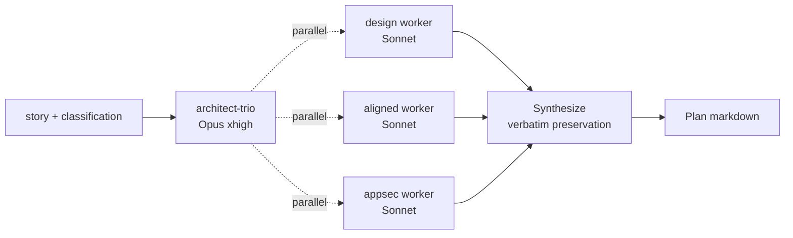

# Agents

> Three agents power the v1.0 pipeline. Each has a tightly-scoped role, a dedicated model class, and its own `memory/` directory.

| Agent | Stage | Model | Effort | maxTurns | Mode |
|---|---|---|---|---|---|
| [`api-architect-trio`](#api-architect-trio) | Architecture | Opus 4.7 xhigh | high | 25 | Read-only, dispatches |
| [`api-implementer`](#api-implementer) | Dev | Opus 4.7 high | high | 35 | Read/Write |
| [`gerard-gatekeeper`](#gerard-gatekeeper) | Review | Sonnet 4.6 | high | 20 | Read-only, fresh session |

Each agent's full definition lives in `agents/<name>/agent.md`. The summaries below pull out what callers and contributors need to know.

---

## `api-architect-trio`

**File** : `agents/api-architect-trio/agent.md`
**Memory** : `agents/api-architect-trio/memory/`
**Tools** : `Read`, `Glob`, `Grep`, `Bash`, `Agent`, `Monitor`
**Skills declared** : 22 (the API Platform 4.3 surface + symfony-voters + rate-limiting)

### Role

The architecture-stage lead. It does **not** draft the plan directly — it dispatches three Sonnet workers in parallel (`isolation: "worktree"`), each with a specialized prompt, and synthesizes their returns into one consolidated plan.



### Inputs

From `/api` via Task dispatch :
- `STORY` — the natural-language story text.
- Detected story shape (`feature`/`refactor`/`migration`/`hardening`/`docs-only`).
- Detected API Platform area (`resource`/`filter`/`provider`/...).
- Detected surface (`internal`/`public`).
- Chosen effort level.
- The composed `/goal` condition (so the architect knows what the gatekeeper will check).

### Outputs

A single consolidated markdown plan, returned via the Task return value :

```
# Architecture plan for: <story>

**Story shape:** ...
**API Platform area:** ...
**Surface:** ...

## 1. Modèle proposé
## 2. Architecture produit & interaction
## 3. Performance & discoverability
## 4. Trade-offs considérés
## 5. Modes de défaillance
## 6. Smallest next step that proves or falsifies the design
## 7. Required dependency adds
## 8. Test matrix      ← literal 4-column format, every HTTP-status AC as its own line
## 9. Skill / sub-agent dispatch list

## Aligned-Reviewer note (preserve verbatim)
<from aligned worker — copied as-is>

## Security — AppSec findings (preserve verbatim)
<from appsec worker — table copied as-is>
```

Cap : 30 KB. If exceeded, the design sections (1-7) are summarized to ≤ 10 KB ; the Aligned-Reviewer block and AppSec table are **always** preserved verbatim.

### Memory pattern

Reads `agents/api-architect-trio/memory/` as its **first action**. Each file is one short topical entry (≤ 30 lines), one topic per file. Examples :

- `cache-tagging-strategy.md` — "On this project, public resources use `tags: [self::class.':'.identifier]` ; the cache invalidation runs on every State Processor return."
- `property-security-shape.md` — "Recurring pattern : `#[ApiProperty(security: "is_granted('VIEW', object)")]` on PII fields, voter checks at entity level."

Writes a new entry only when a session **revealed a new architectural pattern worth remembering** — not on every run. Memory is not a journal.

### Anti-patterns this agent guards against

The agent's prompt embeds a **match-and-refuse list** that surfaces training-default mistakes :

- Scalar ID in payload (`int $customerId`) → IRI-only (`Customer $customer`)
- Custom Processor where Object Mapper 4.3 (`#[Map]`) is mechanical-mapping enough
- Subresource where flat URI works
- `#[ApiFilter]` (4.2-deprecated) → `parameters: [QueryParameter]` 4.3 modern
- Voter where `security:` expression suffices (and vice versa)
- Free `string $status` → `BackedEnum`
- Auto-increment `int` ID on public resource → UUID v7

When a pattern surfaces "without effort", suspect training noise. The 4.3 canon lives in the `gerard:api-platform-*` skills.

### When to invoke directly

Normally you don't — `/api` does it. But you can dispatch the agent manually for design-only work :

```
@agent-api-architect-trio plan a CSV-export feature for the existing Order resource (public surface, large volume).
```

---

## `api-implementer`

**File** : `agents/api-implementer/agent.md`
**Memory** : `agents/api-implementer/memory/`
**Tools** : `Read`, `Write`, `Edit`, `Bash`, `Glob`, `Grep`
**Skills declared** : 23 (API Platform 4.3 surface + tdd-php + runner-selection + makefile-discipline)

### Role

The dev stage. Receives the architect-trio's plan via Task input, writes the code + tests + AppSec mitigations, iterates until phpstan / phpunit are green, returns a Definition-of-Done report.

### Inputs

From `/api` (or from architect-trio's hand-off) :
- The full consolidated plan (sections 1-9 + Aligned-Reviewer + AppSec).
- The original `STORY`.
- Chosen effort.
- If a previous gatekeeper review exists : the `REQUEST_CHANGES` feedback appended.

### Outputs

A single Definition-of-Done markdown report, returned via Task return :

```
# Implementation report

## Ce qui a changé et pourquoi
## Files touched
## Skills dispatched               ← each line MUST correspond to a real Skill() / Task() call
## Quality gate output             ← phpstan, phpunit, infection
## Profondeur du plan              ← confirm every anticipation in the code
## AppSec findings applied         ← every H* mitigation with file:line
## Self-audit Anti-patterns 4.3    ← Y/N checklist filled
## Run-it-yourself proof           ← curl, Playwright shot, or profiler note
## Open questions / limitations
```

### Memory pattern

Reads `agents/api-implementer/memory/` first. Stores project-specific implementation patterns :

- `make-target-quality.md` — "On this project, `make ci` chains `make quality` + `make migrations` + `make tests`. Use `make ci` for full gate, `make tests` for tight loop."
- `voter-pattern.md` — "Recurring voter shape : extend `Voter`, expose attribute constants (`Voter::VIEW = 'view'`), test in isolation with `MockVoter` + `TokenInterface` mock."

### Quality gate

The implementer prefers project-canonical commands surfaced by the session-start hook :

| `runner_type` | Static analysis | Tests | Migrations | CI gate |
|---|---|---|---|---|
| `make` | `make quality` | `make tests` | `make migrations` | `make ci` |
| `ddev` | `ddev exec ./vendor/bin/phpstan analyse` | `ddev exec ./vendor/bin/phpunit --filter=Api` | `ddev exec bin/console doctrine:migrations:migrate` | (combine) |
| `symfony-docker` | `docker compose exec php ./vendor/bin/phpstan analyse` | `docker compose exec php ./vendor/bin/phpunit --filter=Api` | `docker compose exec php bin/console doctrine:migrations:migrate` | (combine) |
| `host` | `./vendor/bin/phpstan analyse` | `./vendor/bin/phpunit --filter=Api` | `php bin/console doctrine:migrations:migrate` | (combine) |

For mutation testing on critical classes : `./vendor/bin/infection --filter=<ClassName>`. Critical classes = domain handlers, value objects with invariants, aggregates, processors mutating state, voters, finance / rights / PII code.

### Anti-patterns this agent refuses to write

The agent's prompt embeds a 19+4 entry refuse list. Highlights :

- `#[ApiFilter(SearchFilter::class, ...)]` (use modern `parameters` pattern)
- `extends AbstractFilter` (use `FilterInterface` + `BackwardCompatibleFilterDescriptionTrait`)
- `openapiContext: ['deprecated' => true]` (use `openapi: new Model\Operation(deprecated: true)`)
- `'hydra:member'` in tests (4.x default `hydra_prefix: false`)
- `ApiPlatform\Core\…` imports (renamed in 4.x)
- `// TODO`, `// FIXME`, code commenté
- `mixed` in public signature

Full enumerated list : [`anti-patterns.md`](anti-patterns.md).

### Skill-dispatch theatre — what the gatekeeper catches

If the implementer's report claims "I dispatched `gerard:api-platform-filters`", a corresponding `Skill()` or `Task(subagent_type=…)` call MUST appear in this session's tool stream. The gatekeeper verifies. Phantom dispatches = auto-reject.

### When to invoke directly

For ad-hoc implementation work hors-pipeline :

```
@agent-api-implementer apply the plan in last-plan.md, focus on the Filters area.
```

---

## `gerard-gatekeeper`

**File** : `agents/gerard-gatekeeper/agent.md`
**Memory** : `agents/gerard-gatekeeper/memory/`
**Tools** : `Read`, `Grep`, `Glob`, `Bash`
**Skills declared** : 10 (quality-checks + controller-cleanup + value-objects-and-dtos + 7 API Platform surfaces)

### Role

The review stage. Last line of defense before merge. Opens in a **fresh session** — no shared context with the implementer. That's deliberate : the gatekeeper sees the diff cold, the way a human reviewer would.

### Inputs

From `/api` (or piped from implementer report) :
- The architect-trio plan (classification header, 9 sections, Aligned-Reviewer note, AppSec findings table).
- The implementer's DoD report.
- Optional : test/coverage report with MSI per critical target.

If any of these are missing, the gatekeeper flags in `===EVIDENCE===` and requests the gap.

### Outputs

A strict-format Task return :

```
VERDICT: APPROVE                                  ← or REQUEST_CHANGES (exact, first non-empty line)

===EVIDENCE===
- Skills dispatched: <list>
- Diff inspected: <N> files, +<X>/-<Y> lines
- Commands run: <list>
- Inputs read: plan, implementer report, (test report if present)
- API Platform anti-patterns checklist: <N/16> pass
- Symfony 7.4+ anti-patterns checklist: <N/8> pass
- AppSec findings bilan: (table)
===EVIDENCE-END===

## Diff classification
**Diff type:** code | docs | config | mixed
**API Platform area:** ...
**Operation type:** ...
**Surface:** ...

## Rationale (on APPROVE)
## Out of scope for this review:      ← mandatory on APPROVE

## OR (on REQUEST_CHANGES) — Numbered findings
1. **Rule #<N>** — <file:line> — <change required>. Per gerard:<skill>, canonical fix: ...
```

### Verdict format — strict

The first non-empty line is **exactly** :

- `VERDICT: APPROVE`
- `VERDICT: REQUEST_CHANGES`

No modifiers (`APPROVE WITH CAVEATS` forbidden). No emoji. No markdown wrapping. The `/goal` Haiku evaluator parses this line strictly.

### The 39-rule checklist

| Bucket | Count | Source |
|---|---|---|
| API Platform 4.3 anti-patterns | 16 | rules 1-16 in [`anti-patterns.md`](anti-patterns.md) |
| Symfony 7.4+ anti-patterns | 8 | rules 17-24 |
| Project conventions (Makefile-solution split) | 1 | rule 25 |
| Test rules | 7 | rules 26-32 |
| AppSec rules | 7 | rules 33-39 |

A single violation = `VERDICT: REQUEST_CHANGES`. No "follow-up" path for these.

### Memory pattern

Reads `agents/gerard-gatekeeper/memory/` first. Accumulates :

- Project-specific gotchas (recurring shapes the implementer keeps producing).
- False-positives to NOT flag (e.g. legitimate `mixed` in an interface required by vendor code).
- Doctrine quirks the implementer learned the hard way.

Writes a new entry only when a review surfaced a **new** anti-pattern specific to this project.

### Cap unverified claims

A "VERDICT" without backing evidence is rubber-stamp. The gatekeeper :

- Distinguishes first-hand verification ("I ran X") from relayed information ("the dev report says X").
- Requires every "I dispatched skill X" claim in the implementer report to have a real `Skill()` call in the implementer session's tool stream. If the stream is not accessible, flags in EVIDENCE.

### When to invoke directly

For an audit of an already-merged diff or a hand-written PR :

```
@agent-gerard-gatekeeper review the diff main...HEAD against the 39-rule checklist.
```

---

## Cross-cutting : the memory directory protocol

Each agent owns one memory directory. The contract is uniform :

1. **First action** : `Read` the directory. If `.gitkeep` only, this is the first run.
2. **Last action** : if the session revealed a new pattern, append one short file (≤ 30 lines, one topic per file). Otherwise skip — memory is not a journal.
3. **Naming** : kebab-case topical filename, no timestamp prefix. `cache-tagging-strategy.md` not `2026-05-14-cache.md`.
4. **Cap** : naturally bounded by ~30 lines per file × ~10 files per agent ≈ ~300 lines per memory dir. Beyond that, Dreaming consolidates (auto), or `/api-doctrine export` snapshots and resets manually.

See [`forensic-loop.md`](forensic-loop.md) for the full lifecycle pattern.

---

## References

- [`v1.0-plan.md`](v1.0-plan.md) section 1, decision #6 (Agent-3) — rationale
- [`how-it-works.md`](how-it-works.md) — the agents in context (sequence diagrams)
- [`anti-patterns.md`](anti-patterns.md) — the canonical 24-rule checklist
- [`forensic-loop.md`](forensic-loop.md) — memory lifecycle
- [`skills.md`](skills.md) — the 53 skills the agents dispatch
