# Commands

> Three user-facing commands. Everything else is internal agent orchestration.

| Command | Description | Section |
|---|---|---|
| `/api <story>` | Implement a story end-to-end | [↓](#api) |
| `/api-finalize` | Commit + push + open PR | [↓](#api-finalize) |
| `/api-doctrine` | Export / import / list memory snapshots | [↓](#api-doctrine) |

---

## `/api`

**File** : `commands/api.md`
**Allowed tools** : `Bash`, `Read`, `Glob`, `Grep`, `Task`, `Monitor`

### Usage

```text
/api <story text> [--interactive] [--effort low|high|xhigh]
```

### What it does

Single entry point for "implement this API story". Orchestrates three v1.0 agents (architect-trio → implementer → gatekeeper) and lets native `/goal` (Claude Code 2.1.139+) drive the loop until the gatekeeper approves.

### Flags

| Flag | Default | Effect |
|---|---|---|
| `--interactive` | off | After the architect-trio returns, pause and ask the user to approve the plan before continuing to implementer. Useful for high-impact features. |
| `--effort low` | — | Light-weight pass : skills loaded in their `low` variant (SKILL.md only, no reference.md). Fewer turns. |
| `--effort high` | **default** | Skills loaded in their `high` variant (SKILL.md + reference.md). Standard depth. |
| `--effort xhigh` | — | Skills loaded in their `xhigh` variant (SKILL.md + reference.md + project overrides + edge cases). For complex / unfamiliar areas. |

### Pipeline



```mermaid
flowchart LR
    Story[story + flags] --> Pre[Pre-flight<br/>git clean<br/>branch<br/>parse args]
    Pre --> Shape[Detect story shape<br/>keyword heuristic]
    Shape --> Goal[Compose /goal condition<br/>read goal-patterns skill]
    Goal --> Arch[Dispatch architect-trio<br/>Opus xhigh + 3 Sonnet workers]
    Arch --> Interactive{--interactive?}
    Interactive -->|yes| Approve[Ask user to approve plan]
    Interactive -->|no| Loop
    Approve --> Loop[/goal loop:<br/>implementer ⇄ gatekeeper<br/>cap 12 turns/]
    Loop --> Clear[Goal cleared<br/>terminalSequence notif]
    Clear --> Note[Print: run /api-finalize to commit + PR]
```

### Step-by-step

1. **Pre-flight** : `git rev-parse`, `git status --porcelain`, `git symbolic-ref`. Hard checks :
   - Working tree must be clean (no uncommitted / untracked work)
   - Must be inside a git repo
   - Not on `main` / `master` / `develop` (else ask for a branch name and `git checkout -b api/<slug>`)
2. **Parse args** : extract `--interactive`, `--effort`, the rest is `STORY`. Empty story = STOP.
3. **Classify the story shape** with keyword heuristics on `STORY` :

   | Shape | Trigger keywords |
   |---|---|
   | `new-resource` | "add resource", "new entity", "create X resource" |
   | `new-operation` | "add Patch", "expose Delete", "new operation on" |
   | `new-filter` | "filter", "search by", "sort by", "facet" |
   | `new-state-flow` | "state processor", "state provider", "workflow" |
   | `migration` | "migrate", "doctrine migration", "schema change" |
   | `bugfix` | "fix", "bug", "regression", "crash" |
   | `refactor` | "refactor", "extract", "rename", "split" |
   | `security-hardening` | "harden", "auth", "JWT", "Voter", "CORS" |
   | `generic` | (fallback) |

4. **Compose the `/goal` condition** by reading `Skill gerard:goal-patterns` and appending the addendum matching the detected shape. See [`goal-patterns.md`](goal-patterns.md).
5. **Dispatch the architecture stage** via `Task(subagent_type=api-architect-trio, ...)`.
6. **Interactive checkpoint** (only if `--interactive`) : print the plan and ask "Approve to continue?".
7. **Launch the native `/goal` loop** : implementer ⇄ gatekeeper, hard cap at 12 turns.
8. **On goal-clear** : print a one-line banner. Do NOT commit. Do NOT push. `/api-finalize` is the inspection point.

### Examples

```bash
# Simplest — new resource, full auto
/api "Add a Product resource with name, price and BackedEnum status"

# With interactive checkpoint after the architect-trio
/api "Refactor Order resource to use Object Mapper 4.3 instead of DTO Input/Output" --interactive

# High effort for an unfamiliar area
/api "Add MCP tool exposure for the Order resource" --effort xhigh

# Bugfix
/api "Fix the 500 returned by /api/orders when paginationPartial=true is used"
```

### What it does NOT do

- Does not commit. `/api-finalize` handles that.
- Does not push to remote.
- Does not open a PR.
- Does not edit the working tree on its own — only the implementer agent does. `/api` is a controller.
- Does not skip pre-flight checks for any flag.

### Failure / escape hatch

If the user cancels mid-flow, or the loop hits the 12-turn cap, or any agent errors out :

- The working tree is left as-is (not reverted).
- A summary of what was attempted + the last gatekeeper verdict is printed.
- Resume hint : re-run `/api "<same story>" --interactive` for human-in-the-loop, or hand-edit and re-run.

---

## `/api-finalize`

**File** : `commands/api-finalize.md`
**Allowed tools** : `Bash`, `Read`, `Glob`, `Grep`

### Usage

```text
/api-finalize [--no-push] [--no-pr]
```

### What it does

After `/api` clears the goal : compose a commit message from the conversation context, stage explicitly (skipping secrets + legacy state files), commit, push, and open a PR.

**Separate command on purpose** (decision C in [`v1.0-plan.md`](v1.0-plan.md) section 1) : the user has the chance to review the gatekeeper-approved diff before anything leaves the local machine.

### Flags

| Flag | Default | Effect |
|---|---|---|
| `--no-push` | off | Skip the `git push` step. Just commit. |
| `--no-pr` | off | Skip `gh pr create`. (Equivalent to `--no-push` when `gh` is absent.) |

### Pipeline



```mermaid
flowchart LR
    Start --> Pre[Pre-flight<br/>not on main<br/>porcelain non-empty<br/>no rebase/merge in progress]
    Pre --> Staging[Build staging list<br/>EXCLUDE secrets + legacy state files]
    Staging --> Confirm{Anything excluded?}
    Confirm -->|yes| Ask[Print exclusions, ask user]
    Confirm -->|no| Commit
    Ask --> Commit[Compose message<br/>scope: subject + Why/What/Verification]
    Commit --> Add[git add -- &lt;explicit paths&gt;]
    Add --> Cmt[git commit<br/>NO --amend, NO --no-verify]
    Cmt --> Push{--no-push?}
    Push -->|no| DoPush[git push -u if no upstream]
    Push -->|yes| Skip
    DoPush --> PR{--no-pr ∨ gh missing?}
    Skip --> PR
    PR -->|no| GH[gh pr create with template]
    PR -->|yes| End
    GH --> End[Print PR URL]
```

### Hard rules

- **Stage explicitly per file** : `git add -- <path1> <path2>`. **Never** `git add -A` / `git add .`.
- **Never** `--amend` / `--no-verify` / `--no-gpg-sign`. Hook failure → fix root cause, re-stage, create a NEW commit.
- **Never** force-push from this command. If a non-fast-forward push is needed, STOP and ask the user.
- **Never** auto-add untracked files matching secret patterns (see `pre-tool-use.sh` patterns).

### Excluded paths (skipped at staging time)

| Pattern | Reason |
|---|---|
| `.env*`, `*.pem`, `*.key`, `*.p12`, `*.pfx`, `*credentials*`, `*.crt`, `id_rsa`, `id_ed25519`, `id_ecdsa`, `*.kdbx` | Secret patterns (mirror PreToolUse) |
| `.claude/last-api-*.md`, `.claude/api-*.tmp` | Legacy v0.1 state files |
| `.claude/memory-snapshots/*` | Unless the user explicitly asked to include them |

If anything is excluded, the user sees the list and confirms before staging.

### Commit message template

```text
<scope>: <subject — imperative, ≤ 72 chars>

Why:
  <1-3 sentence rationale tied to the original /api story>

What:
  - <bullet of the main change>
  - <bullet>
  - <bullet>

Verification:
  - gerard-gatekeeper APPROVE
  - tests: <list of test commands run, all passing>
  - AppSec bilan: <status — no H1/H2 open>
```

No "Generated by Claude" trailer. Picks `<scope>` from the touched paths (`api`, `doctrine`, `security`, `tests`...).

### PR body template

```markdown
## Summary
<2-3 bullets from the commit Why + What>

## How it was built
- Architect-trio plan: <one-line summary>
- Implementer: <one-line summary>
- Gatekeeper: APPROVE

## Test plan
- [ ] <test command 1>
- [ ] <test command 2>

## AppSec
<copy the gatekeeper's AppSec bilan table verbatim>

## Out of scope
<copy the gatekeeper's Out-of-scope section verbatim>
```

### Examples

```bash
# Default — commit + push + PR
/api-finalize

# Local-only commit (no push, no PR)
/api-finalize --no-push --no-pr

# Push but no PR (for branches that aren't ready to merge yet)
/api-finalize --no-pr
```

---

## `/api-doctrine`

**File** : `commands/api-doctrine.md`
**Allowed tools** : `Bash`, `Read`, `Write`, `Glob`, `Grep`

### Usage

```text
/api-doctrine export <name>
/api-doctrine import <name>
/api-doctrine list
```

### What it does

Export, import, or list versionable snapshots of the three agents' memory directories. This is the **M3 hybrid auto-memory strategy** (decision A in [`v1.0-plan.md`](v1.0-plan.md) section 1) : volatile native memory by default, opt-in snapshots for versioning.

Snapshots live under `.claude/memory-snapshots/<name>.md`. They are **never** auto-loaded ; users must `/api-doctrine import <name>` explicitly.

### Why it exists

Each agent's `memory/` dir evolves per-session (`agents/api-architect-trio/memory/`, etc.). When a team wants to share or version a calibrated state — "the doctrine we agreed on for project X" — `/api-doctrine export <name>` consolidates the three memory dirs into a single committable markdown file.

### Sub-commands

#### `export <name>`

1. Validates `<name>` (kebab-case, no spaces, no path separators).
2. Creates `.claude/memory-snapshots/` if absent.
3. If `.claude/memory-snapshots/<name>.md` already exists : asks for overwrite confirmation. Default = abort.
4. Reads all `*.md` from the three agent memory dirs (skipping `.gitkeep` and empties).
5. Writes a single markdown file with sections per agent :

   ```markdown
   ---
   name: <name>
   created: <ISO 8601 timestamp>
   generated-by: gerard /api-doctrine export
   plugin-version: 1.0.0
   ---

   # Doctrine snapshot — <name>

   ## agents/api-architect-trio/memory
   ### <filename without extension>
   <file content verbatim>
   ---

   ## agents/api-implementer/memory
   ### ...

   ## agents/gerard-gatekeeper/memory
   ### ...
   ```

6. Prints : `gerard: snapshot exported to .claude/memory-snapshots/<name>.md. Commit it to share with the team.`
7. Suggests : `git add .claude/memory-snapshots/<name>.md && git commit -m "doctrine: snapshot <name>"`.

#### `import <name>`

1. Reads `.claude/memory-snapshots/<name>.md`. If absent : STOP, suggest `list`.
2. Parses the three sections. For each `### <filename>` subsection, reconstructs the original file path : `agents/<agent>/memory/<filename>.md`.
3. If the target file already exists locally : appends `-imported-<timestamp>` to the new name to avoid clobbering live state.
4. Writes the content.
5. Prints a summary table : rows = `<agent>/<file>`, status = `new` / `renamed-to-avoid-clobber`. Total = N files written.

#### `list`

```text
.claude/memory-snapshots/
├── 2026-05-01-baseline.md     12K   2026-05-01
├── q2-prelaunch-doctrine.md   31K   2026-05-12
└── ...
```

If the dir doesn't exist or is empty : `No snapshots found. Use /api-doctrine export <name> to create one.`

### Examples

```bash
# Right after onboarding a new project — capture the empty baseline
/api-doctrine export 2026-05-01-baseline

# After a productive week of API stories that calibrated the agents — snapshot it
/api-doctrine export q2-prelaunch-doctrine

# A teammate pulls the repo with the snapshot committed — they import it
/api-doctrine import q2-prelaunch-doctrine

# Check what's available
/api-doctrine list
```

### Safety rails

- Never reads or writes outside `agents/*/memory/` or `.claude/memory-snapshots/`.
- Never commits. Export prints a `git add` suggestion but doesn't run it.
- Never auto-imports on session start. Imports are always explicit and user-initiated.
- If a memory file contains anything that looks like a secret (matches the pre-tool-use patterns), refuses to include it in the snapshot and tells the user which file to clean up.

### When to use

- **Onboarding a new repo** : `export` an empty baseline to mark "day zero". Re-import if memory drifts unexpectedly.
- **Team handoff** : `export q4-handoff` so the next developer starts with the same calibration.
- **Release boundaries** : `export pre-v2-launch` to freeze the doctrine state before a major refactor.
- **Memory recovery after `/clear`** : if you accidentally wiped agent memory and have a recent snapshot, `import` it to restore.

See [`forensic-loop.md`](forensic-loop.md) for the full forensic-loop pattern, including when to snapshot vs let Dreaming consolidate.

---

## References

- [`v1.0-plan.md`](v1.0-plan.md) section 1, decision C — `/api-finalize` separation rationale
- [`v1.0-plan.md`](v1.0-plan.md) section 1, decision A — M3 hybrid auto-memory strategy
- [`goal-patterns.md`](goal-patterns.md) — the `/goal` condition templates used by `/api` step 4
- [`agents.md`](agents.md) — the three agents `/api` dispatches
- [`hooks.md`](hooks.md) — pre/post-tool-use enforcement during `/api` runs
- [`forensic-loop.md`](forensic-loop.md) — why memory snapshots matter
