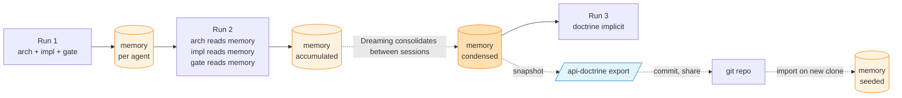

# The forensic loop

> How `gerard` gets better at your project over time. Memory directories accumulate, Dreaming consolidates, snapshots version. The pattern is *ship → measure → tighten doctrine with explicit forbids*.

## The mental model

Imagine a senior reviewer who started on your project last Monday. Week 1 they catch obvious mistakes ; week 4 they know the project's quirks ; week 12 they know that one engineer's preferred-but-misguided pattern that always needs pushback.

That accumulation is the forensic loop. v1.0 implements it across three mechanisms :



Three layers from fastest to slowest :

1. **Per-agent memory directories** (per session, persistent)
2. **Dreaming consolidation** (between sessions, automatic, Anthropic research preview)
3. **`/api-doctrine export/import` snapshots** (manual, versionable, shareable)

---

## Layer 1 — Per-agent memory directories

### Structure

```text
agents/
├── api-architect-trio/memory/
│   ├── .gitkeep
│   ├── cache-tagging-strategy.md
│   ├── property-security-shape.md
│   └── recurring-rate-limit-pattern.md
├── api-implementer/memory/
│   ├── .gitkeep
│   ├── make-target-quality.md
│   └── voter-pattern.md
└── gerard-gatekeeper/memory/
    ├── .gitkeep
    ├── false-positive-mixed-on-interface.md
    └── recurring-iri-leak-shape.md
```

Each `.md` file is one short topical entry (≤ 30 lines, one topic per file). Naming is kebab-case, no timestamps.

### Lifecycle per session

Every agent follows the same memory protocol :

1. **First action** : `Read agents/<agent>/memory/` (Glob then Read each .md). Skip if only `.gitkeep`.
2. **During work** : leverage the patterns to skip rediscovery. If memory says *"On this project, the voter pattern is X"*, the implementer doesn't need to re-search for the canonical Symfony voter shape — apply X.
3. **Last action (if something was learned)** : append one new short file. Skip on unremarkable runs.

### What goes in memory

| Agent | Good memory entries | Bad memory entries |
|---|---|---|
| `api-architect-trio` | *"Cache-tag strategy used : `tags: [self::class.':'.identifier]`. Invalidation runs on every State Processor return."* | *"Did architecture for Product feature on 2026-05-14"* (journal entry, no doctrine value) |
| `api-implementer` | *"Project uses `make ci` to chain quality + tests + migrations. Use it for full gate."* | *"Wrote Product.php today."* (journal, not pattern) |
| `gerard-gatekeeper` | *"False positive on rule 19 (`mixed` in public signature) — vendor interface `Symfony\Foo\Bar` requires it, our impl matches. Don't reject."* | *"Rejected 3 PRs this week."* (statistics, not actionable doctrine) |

The discipline : **memory is doctrine, not journal**. If the next reader couldn't extract a rule or pattern from the entry, it doesn't belong there.

### Why per-agent (not shared)

Each agent has a different perspective on the codebase :

- The architect cares about patterns at the design surface (cache strategies, voter shapes, surface vs internal trade-offs).
- The implementer cares about commands and tools that work on this project's runner.
- The gatekeeper cares about anti-patterns that keep recurring vs false-positives to suppress.

A shared memory would conflate three lenses. Per-agent keeps each focused.

### Memory size

Naturally bounded :

- ~30 lines per file × ~10 files per agent ≈ ~300 lines per memory dir
- Three agents = ~900 lines total memory across the project

Beyond that, two mechanisms keep memory healthy : Dreaming (auto) or snapshots (manual reset).

---

## Layer 2 — Dreaming consolidation

> **Status (May 2026)** : research preview, ships with Claude Code. Read [the Dreaming announcement](https://letsdatascience.com/blog/anthropic-dreaming-claude-managed-agents-self-improving-may-6) for context.

Between sessions, Dreaming runs background consolidation across agent memory. It :

- Identifies entries that repeat the same pattern in slightly different phrasings → merges into one canonical entry.
- Identifies entries that contradict each other → flags for human review (or picks the more recent unless older is stronger).
- Identifies entries that haven't been referenced in 30+ runs → archives (still present, but de-prioritized in next-read).

The agent reads the consolidated state on its next session. Drift gets compressed automatically.

**Caveat** : Dreaming is opt-in at the Claude Code level. If you don't see consolidation happening, check your Claude Code settings or upgrade. v1.0 doesn't require Dreaming, but the forensic loop is markedly better with it.

---

## Layer 3 — `/api-doctrine` snapshots

When you want to **version** a calibrated state — pin "this is the doctrine we agreed on for project X" — export a snapshot.

### Export

```text
/api-doctrine export q2-prelaunch-doctrine
```

Writes `.claude/memory-snapshots/q2-prelaunch-doctrine.md` containing all three agents' memory dirs in a single readable markdown. The snapshot is **not** auto-loaded — it's a versionable artefact.

### Import

```text
/api-doctrine import q2-prelaunch-doctrine
```

Reads the snapshot, reconstructs the per-agent memory dirs. If a target file already exists locally, suffix `-imported-<timestamp>` to avoid clobbering live state. The next time each agent reads its memory dir, it picks up the imported entries.

### When to snapshot

| Trigger | What to capture |
|---|---|
| **Onboarding** | The empty baseline. Mark "day zero" so you can see how the doctrine accumulates. |
| **Team handoff** | The calibrated state at the moment of handoff. New developer imports → starts at the same calibration. |
| **Pre-release freeze** | Lock in the doctrine before a major refactor / release. If post-refactor doctrine drifts in a wrong direction, revert by re-importing. |
| **`/clear` recovery** | If you accidentally cleared agent memory, import the most recent snapshot. |
| **Periodic backup** | Monthly or quarterly. A small price for resilience. |

### Snapshot format

```markdown
---
name: q2-prelaunch-doctrine
created: 2026-05-14T10:23:45Z
generated-by: gerard /api-doctrine export
plugin-version: 1.0.0
---

# Doctrine snapshot — q2-prelaunch-doctrine

## agents/api-architect-trio/memory

### cache-tagging-strategy
<verbatim file content>

### property-security-shape
<verbatim file content>

---

## agents/api-implementer/memory
...
```

The format is human-readable and diff-friendly. Commit it to git so the team can see the doctrine evolve in PRs.

### Why this complements Dreaming

Dreaming is automatic and continuous. Snapshots are explicit and discrete. Together :

- Dreaming keeps the live memory healthy between sessions.
- Snapshots let you **freeze** a calibration for sharing or rollback.

You'd use both : let Dreaming run, but `export` snapshots at meaningful milestones.

---

## Pattern observation template

When you write a memory entry, follow this template so future-you (or a teammate via snapshot) can extract the rule cleanly :

```markdown
---
name: <kebab-case-slug>
description: <one-line summary>
metadata:
  type: pattern   # or: anti-pattern | false-positive | runner-quirk | doctrine
---

## Observed
<the situation that surfaced the pattern, 1-3 sentences>

## Rule
<the actionable distillation — what to do or not do, plain prose>

## Why
<the reason — usually a past incident, a strong preference, or doctrine reference>

## When to apply
<which surface / story shape / story area triggers this>

## Counter-example (if relevant)
<a case where the rule does NOT apply — keeps it honest>
```

This isn't enforced by the validator — it's a discipline. Discipline matters because memory entries get read in adversarial mode ("does this rule still apply to this story?") not narrative mode.

---

## Anti-patterns of the forensic loop

A few patterns that make the loop ineffective :

- ❌ **Journaling** : "Ran an /api session today, generated 12 files." This is a transcript, not doctrine.
- ❌ **Date-stamped filenames** : `2026-05-14-meeting-notes.md`. Filenames should be topical, not temporal.
- ❌ **Aggregated mega-files** : one 500-line file with 30 topics jammed together. Split into 30 small files.
- ❌ **Repeating canon** : "Use UUID v7 for public IDs." That's in `gerard:api-platform-identifiers` ; doesn't need to be in project memory unless your project has a project-specific deviation.
- ❌ **Stale entries left to rot** : if a memory entry says "use Make target X" but X was renamed, fix or delete the entry. Stale entries mislead the next agent run.

---

## The full loop, condensed

```text
Session N:
  agent.Read(memory/)        # bootstrap from past
  agent.work()                # apply doctrine, save round-trips
  if learned something:
      agent.Write(memory/X.md)  # one topic, ≤ 30 lines

Between sessions:
  Dreaming.consolidate()      # auto

At milestones:
  /api-doctrine export NAME   # freeze for versioning
  git commit                  # ship to team

On new clone / after /clear:
  /api-doctrine import NAME   # warm-start
```

That's the loop. The longer you run it, the better the agents get at your specific codebase.

---

## References

- [`agents.md`](agents.md) — each agent's memory section
- [`commands.md`](commands.md#api-doctrine) — `/api-doctrine` reference
- [`v1.0-plan.md`](v1.0-plan.md) section 1, decision A — M3 hybrid auto-memory strategy
- [`v1.0-plan.md`](v1.0-plan.md) section 1, decision #7 — per-agent memory + Dreaming rationale
- [Dreaming announcement (Anthropic, May 2026)](https://letsdatascience.com/blog/anthropic-dreaming-claude-managed-agents-self-improving-may-6) — external context
