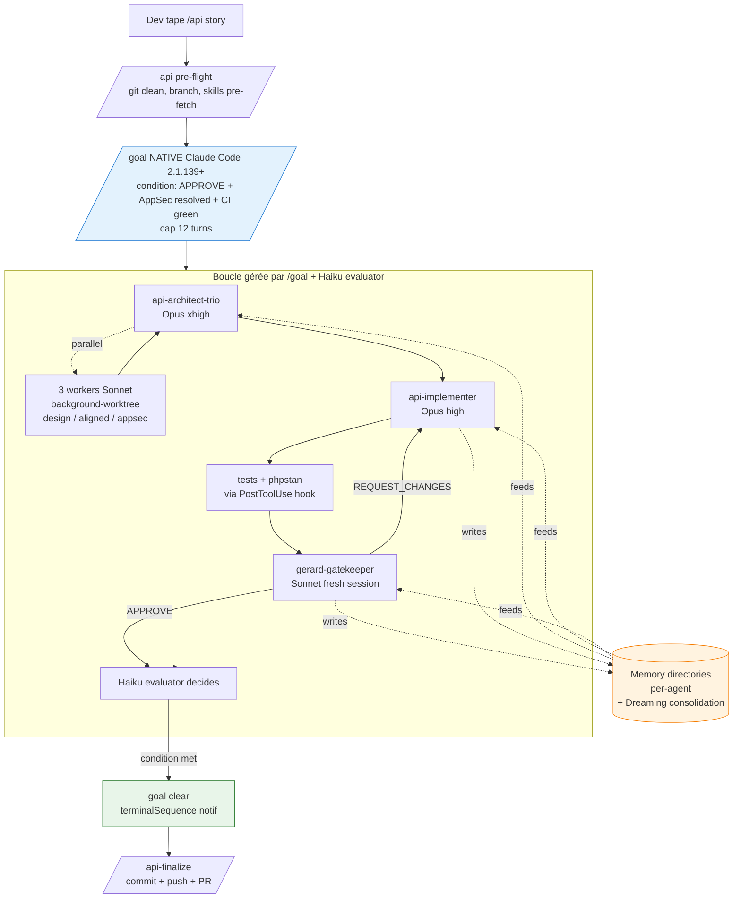
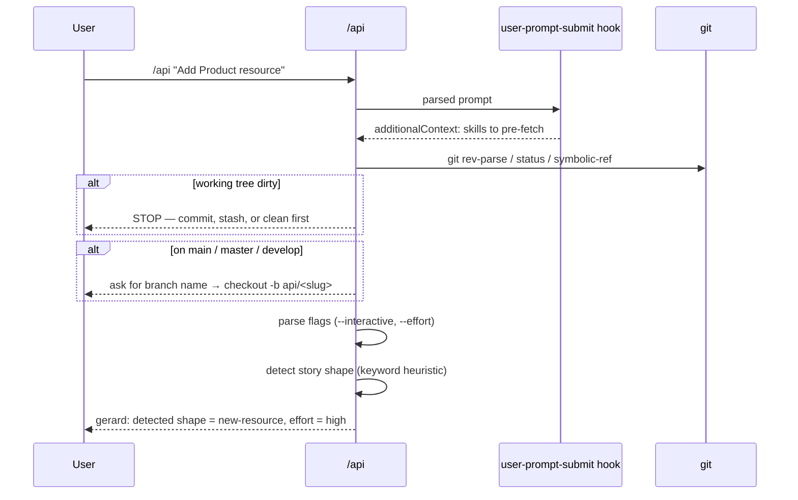
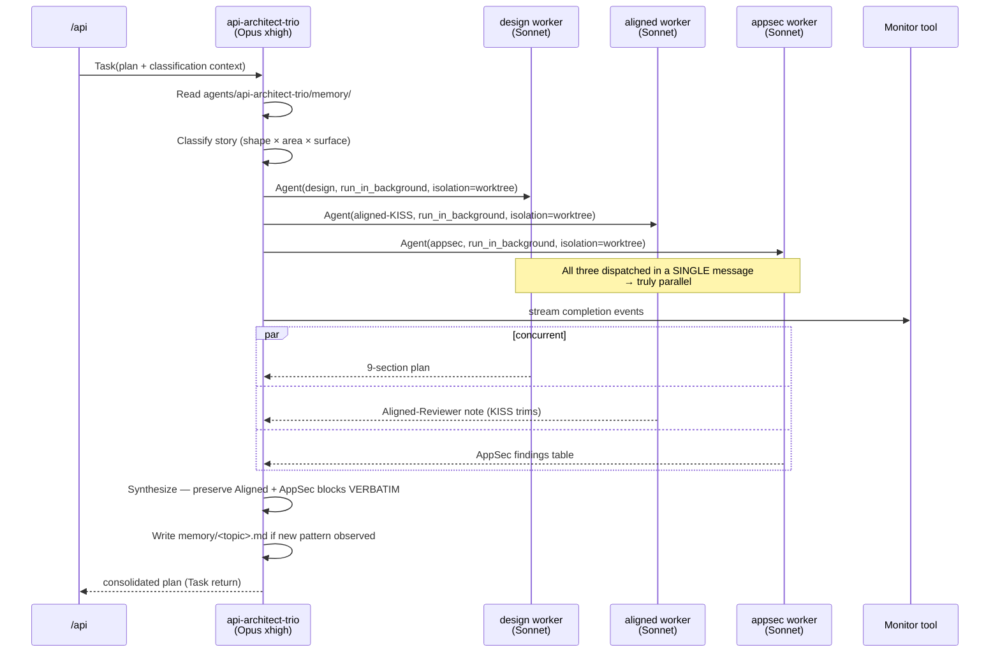
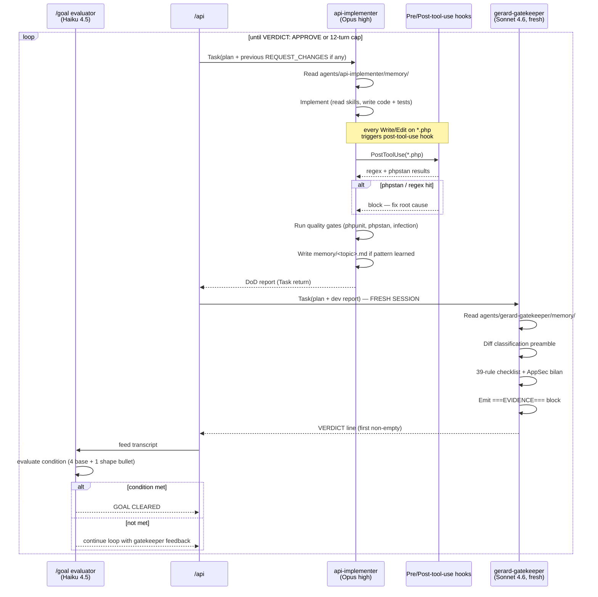
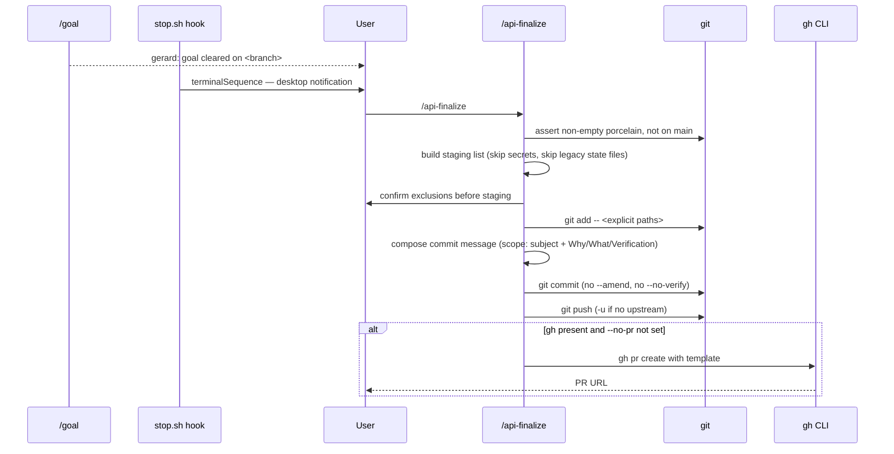

# How it works

> Architecture deep-dive. If you've already read [`overview.md`](overview.md), this is the next stop — full sequence diagrams, multi-model rationale, and the design decisions behind v1.0.

## Table of contents

- [The big picture](#the-big-picture)
- [Stage 1 — `/api` pre-flight](#stage-1--api-pre-flight)
- [Stage 2 — `/goal` composition](#stage-2--goal-composition)
- [Stage 3 — architect-trio dispatch](#stage-3--architect-trio-dispatch)
- [Stage 4 — implementer ⇄ gatekeeper loop](#stage-4--implementer--gatekeeper-loop)
- [Stage 5 — goal clear + `/api-finalize`](#stage-5--goal-clear--api-finalize)
- [Multi-model orchestration: why these models](#multi-model-orchestration-why-these-models)
- [Why three agents (and not five, or seven)](#why-three-agents-and-not-five-or-seven)
- [Why the Stop hook is minimal](#why-the-stop-hook-is-minimal)
- [What we removed from v0.1 (and why)](#what-we-removed-from-v01-and-why)

---

## The big picture

`/api` is the only entry point. It composes a verifiable `/goal` condition, dispatches three internal agents (architect-trio, implementer, gatekeeper), and lets the native Claude Code 2.1.139+ `/goal` primitive drive the loop until the condition clears.



---

## Stage 1 — `/api` pre-flight



Three hard pre-flight checks fail-fast :

1. Working tree must be clean (no uncommitted / untracked work). Refuse mid-flow merges that would entangle the diff.
2. Must be inside a git repo.
3. Refuse to run on `main`/`master`/`develop` without an explicit branch. Default branch name derived from the story (`api/<kebab-slug>`).

If any check fails, `/api` stops and tells the user explicitly.

---

## Stage 2 — `/goal` composition

The `/goal` condition is composed by reading `skills/goal-patterns/SKILL.md` (the source of truth) and appending the addendum matching the detected story shape.

**Base condition (always present, 4 bullets)** :

```text
Goal cleared when:
  1. gerard-gatekeeper returned VERDICT=APPROVE on its last review
  2. AppSec bilan in the latest gatekeeper report has no H1/H2 findings open
  3. all listed test commands pass (status 0 from the session-start runner)
  4. no anti-patterns flagged by post-tool-use hook in the last 3 tool calls
```

These four bullets are **non-negotiable** — they encode the v1.0 enforcement promise. The shape-specific bullet (5) gets appended depending on the story shape. See [`goal-patterns.md`](goal-patterns.md) for the full set.

Hard cap : **12 turns** of the implementer ⇄ gatekeeper loop. Beyond that, the user is asked what to do (the cap mirrors v0.1's "3-REQUEST_CHANGES" cap, generalized to "12 implementer turns").

---

## Stage 3 — architect-trio dispatch



Key points:

- **All three workers run in parallel**, with `isolation: "worktree"` so they read from an isolated copy of the repo. Worktree isolation prevents file-system races and lets each worker explore freely.
- **The Aligned-Reviewer and AppSec blocks are preserved verbatim** in the final plan — they are audit-trail artefacts the gatekeeper checks first-hand. The architect-trio does **not** paraphrase them.
- The architect-trio is **read-only**. It never edits code. Its sole output is the markdown plan.
- The plan is returned **directly via the `Task` return**. No `.claude/last-api-plan.md` state file — that was the v0.1 protocol.

---

## Stage 4 — implementer ⇄ gatekeeper loop



Three properties of this loop matter :

1. **The gatekeeper opens in a fresh session.** It does not share context with the implementer. This is the adversarial design — the gatekeeper sees the diff cold, the way a human reviewer would.
2. **The PostToolUse hook is deterministic.** It catches a tight 7-regex set + phpstan errors *inline*, so the gatekeeper doesn't waste a round-trip rejecting trivial debug residue.
3. **The `/goal` Haiku evaluator** decides clearance. It reads the *rendered condition string* — keep that string unambiguous (no hedge words like "ideally", "if possible"; they lower the gate).

The implementer's `VERDICT: APPROVE` claim alone is not enough — the gatekeeper's `VERDICT: APPROVE` is the load-bearing line.

---

## Stage 5 — goal clear + `/api-finalize`



**`/api-finalize` is a separate command on purpose** (decision C in [`v1.0-plan.md`](v1.0-plan.md) section 1). It is the inspection point — the user has had the opportunity to review the gatekeeper-approved diff before anything leaves the local machine.

Hard rules :
- Stage **explicitly per file** (`git add -- <path>`), never `-A` / `.`. Sensitive paths matching the pre-tool-use secret patterns are excluded.
- Legacy `.claude/last-api-*.md` state files (v0.1 leftovers) are excluded.
- No `--amend`, no `--no-verify`, no `--no-gpg-sign`. Hook failure ⇒ fix root cause, re-stage, create a NEW commit.

---

## Multi-model orchestration: why these models

| Component | Model | Why |
|---|---|---|
| `api-architect-trio` (lead, synthesis) | **Opus 4.7 xhigh** | Architecture is the riskiest stage — wrong decisions cascade. The synthesis step also needs to keep three workers' outputs coherent (verbatim block preservation + KISS-cut inline annotations). Opus xhigh's reasoning depth pays off here. |
| Background workers (design / aligned / appsec) | **Sonnet 4.6** | Each worker has a tightly-scoped doctrinal prompt and a single output shape. They don't need Opus-level synthesis. Three Sonnets in parallel cost ~30% of one Opus session for the same wall-clock latency. |
| `api-implementer` | **Opus 4.7 high** | Implementation needs deep, sustained context to read skills, write code, fix phpstan errors, write tests. The 35-turn cap gives room for skill-by-skill iteration. |
| `gerard-gatekeeper` | **Sonnet 4.6** (fresh session) | The gatekeeper has a deterministic 39-rule checklist. Sonnet 4.6 is sufficient for rule-matching ; the fresh-session aspect is more important than the model class (avoids implementer's blind spots leaking in). |
| `/goal` evaluator | **Haiku 4.5** (Claude Code default) | Reading the verdict line and matching against four bullets is a tiny task. Haiku is the right tool. |

**Net effect** : ~30-40% fewer tokens than running everything on Opus, without documented quality loss. The fresh-session gatekeeper finds bugs the implementer's Opus context wouldn't have surfaced (this is the *adversarial fresh-session* finding from external research — see [`v1.0-plan.md`](v1.0-plan.md) Annexe A).

---

## Why three agents (and not five, or seven)

v0.1 had **seven agents** (architect, aligned-reviewer, appsec, implementer, tdd-coach, reviewer, doctrine-architect). v1.0 has **three**.

Three reasons :

1. **CORE framework benchmarks** + multi-agent coding research (see [`v1.0-plan.md`](v1.0-plan.md) Annexe A) consistently show that **3 well-scoped agents** outperform 5-7 finely-scoped ones for end-to-end coding tasks. Beyond 3 specialized scopes, the orchestration overhead exceeds the specialization benefit.
2. **The architect-trio swallows three v0.1 personas** (architect + aligned + appsec) by dispatching them as background workers under one synthesizer. The Aligned-Reviewer and AppSec verbatim blocks preserve their original distinctness — three voices, one return.
3. **The tdd-coach and doctrine-architect were merged into skills** (`tdd-php`, doctrine-*). The TDD agent's job was to read a doctrine ; making it a skill (read on demand) eliminates the agent-to-agent hand-off without losing the doctrine.

This is documented in [`v1.0-plan.md`](v1.0-plan.md) section 1, decision #6 (Agent-3).

---

## Why the Stop hook is minimal

[`hooks.md#stop`](hooks.md#stop) — Stop hook is **~10 lines of bash** that emit a desktop notification. That's all.

Why so minimal :

- Anti-pattern scans live in the **gatekeeper** (deterministic 39-rule checklist) and the **PostToolUse hook** (deterministic 7-regex inline). Duplicating them in Stop produces false positives during legitimate work (e.g. editing the `api-platform-upgrade` skill, which intentionally documents legacy patterns).
- The Stop hook fires on **every** Claude stop — including mid-loop pauses. Running a heavy scan there would burn CPU on every cycle for no signal gain.
- The desktop notification (`terminalSequence`) is the only useful work to do at Stop time : signal the user that the goal has cleared so they can run `/api-finalize` without staring at the terminal.

This is documented in [`v1.0-plan.md`](v1.0-plan.md) section 1, decision #11 (Stop hook scope: minimal — secret block only [terminalSequence + branch reminder]).

---

## What we removed from v0.1 (and why)

| v0.1 artefact | Why removed |
|---|---|
| 22 atomic commands (`/architect`, `/dev`, `/test`, `/review`, `/symfony-*` × 13, `/brainstorm`, `/write-plan`, `/execute-plan`, etc.) | The Skill tool natively invokes skills ; commands wrapping a single skill were ceremony. The pipeline commands (`/architect`, `/dev`, `/test`, `/review`) became internal agent dispatches under `/api`. |
| `.claude/last-api-*.md` state files | Task returns + auto-memory cover the same hand-off semantically, without the file-system protocol overhead. |
| `===STAGE-BEGIN===` / `===STAGE-END===` marker protocol | Same — Task returns are deterministic to parse. |
| `REQUEST_CHANGES` hard-coded loop cap (3) | Replaced by the `/goal` 12-turn cap, which is more generous and inspectable by the user. |
| `samurai-build` / `samurai/` example refs | They were specific to one external project ; replaced by neutral examples or removed. |
| 4 agents (aligned-reviewer, appsec, tdd-coach, doctrine-architect) | aligned-reviewer + appsec became background workers under architect-trio. tdd-coach + doctrine-architect became skills (read on demand, no agent round-trip). |

The cumulative effect : **~60% less coordinator markdown**, no state-file protocol, less hard-coded retry logic, more native primitive usage.

---

## References

- [`v1.0-plan.md`](v1.0-plan.md) — Internal canonical plan (decisions, rationale, sequencing). Read this if you want the design-rationale level.
- [`agents.md`](agents.md) — The three agents in detail.
- [`hooks.md`](hooks.md) — The five hooks.
- [`commands.md`](commands.md) — `/api`, `/api-finalize`, `/api-doctrine` reference.
- [`anti-patterns.md`](anti-patterns.md) — The 24 anti-patterns (source of truth).
- [`forensic-loop.md`](forensic-loop.md) — Memory + Dreaming + snapshot patterns.
