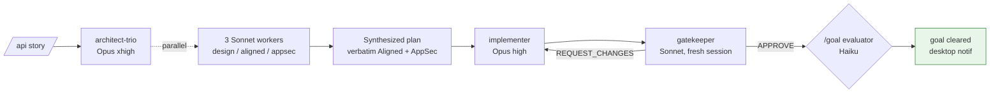

# Overview — 5-minute read

> Goal of this doc: in five minutes, you understand what gerard does, how it does it, and where to look next.

## 🎯 What it does

`gerard` is a Claude Code plugin that turns one English/French story like

> *"Add a Product resource with name, price and a BackedEnum status (DRAFT|PUBLISHED|ARCHIVED)."*

into a reviewed, tested, AppSec-cleared pull request on an **API Platform 4.3 / Symfony 7.4+** codebase.

It does this with **three specialized agents**, **five deterministic hooks**, and a catalog of **53 doctrinal skills** that encode the canonical patterns for API Platform 4.3 and Symfony 7.4+. The native Claude Code `/goal` primitive (2.1.139+) drives the loop until a verifiable condition is met — no bespoke state files, no hard-coded retry counters.

User-facing surface : **three commands** (`/api`, `/api-finalize`, `/api-doctrine`). Everything else is internal orchestration.

---

## ⚡ How `/api` works



Three sentences :

1. The **architect-trio** dispatches three workers in parallel (one drafts the 9-section plan, one applies KISS push-back, one threat-models for AppSec). All three return into a single plan that preserves the KISS and AppSec blocks verbatim.
2. The **implementer** reads the plan, writes the code + tests + AppSec mitigations, runs phpstan/phpunit until green, and returns a Definition-of-Done report.
3. The **gatekeeper** opens in a fresh session (no shared context with implementer — adversarial by design), applies a 39-rule anti-pattern checklist, and returns `VERDICT: APPROVE` or `REQUEST_CHANGES`. The native `/goal` loop keeps cycling implementer ⇄ gatekeeper until the condition clears or hits the 12-turn cap.

---

## 🤖 The 3 agents

| Agent | Stage | Model | One-line role |
|---|---|---|---|
| [`api-architect-trio`](agents.md#api-architect-trio) | Architecture | Opus 4.7 xhigh | Reads memory, classifies story, dispatches 3 parallel Sonnet workers, synthesizes plan. |
| [`api-implementer`](agents.md#api-implementer) | Dev | Opus 4.7 high | Reads memory, writes code + tests, runs quality gates, returns DoD report. |
| [`gerard-gatekeeper`](agents.md#gerard-gatekeeper) | Review | Sonnet 4.6 | Fresh-session adversarial review. 39-rule checklist. EVIDENCE block. APPROVE or REQUEST_CHANGES. |

Each agent owns a `memory/` directory that accumulates findings across runs — patterns the architect rediscovered, voter shapes the implementer learned to apply, anti-patterns the gatekeeper kept catching. See [`forensic-loop.md`](forensic-loop.md).

---

## 🪝 The 5 hooks

| Event | Hook | One-line job |
|---|---|---|
| [`SessionStart`](hooks.md#session-start) | `session-start.sh` | Detect Symfony / API Platform versions, runner type, test framework. Warn if Claude Code < 2.1.139. |
| [`UserPromptSubmit`](hooks.md#user-prompt-submit) | `user-prompt-submit.sh` | If prompt starts with `/api`, parse keywords and inject a system reminder listing the relevant `gerard:*` skills. |
| [`PreToolUse`](hooks.md#pre-tool-use) | `pre-tool-use.sh` | Deny `Write`/`Edit`/`MultiEdit` on secret-shaped filenames. |
| [`PostToolUse`](hooks.md#post-tool-use) | `post-tool-use.sh` | On `*.php` writes : 7 fast-feedback regexes + phpstan (30s timeout). Block with reason if any hit. |
| [`Stop`](hooks.md#stop) | `stop.sh` | Minimal — emit a `terminalSequence` desktop notification when Claude stops. |

The hooks are deterministic ; Claude does not need to choose whether to invoke them. That's the contract — the gatekeeper does the broad subjective review, the hooks do the narrow objective blocks.

---

## 🧠 The forensic loop

The plugin is designed to **get better at your project over time**. Three mechanisms :

1. **Per-agent `memory/` directories** — each agent reads its memory dir as its first action, accumulates short topical files at the end of significant runs. Patterns persist across sessions.
2. **Dreaming consolidation** (Claude Code feature, research preview May 2026) — between sessions, scattered memory entries are condensed into coherent doctrine.
3. **`/api-doctrine export` snapshots** — when you want to *version* a calibrated state (e.g. "the doctrine we agreed on for project X"), export the three memory dirs into a single committable markdown file. Import it back on demand with `/api-doctrine import`.

Full deep-dive : [`forensic-loop.md`](forensic-loop.md).

---

## 🚀 Get started

```bash
# 1. Add the marketplace and install the plugin
/plugin marketplace add gerard-labs/superpowers-api-platform
/plugin install gerard@superpowers-api-platform

# 2. Inside your Symfony 7.4+ / API Platform 4.3+ project
/api "Add a Product resource with name, price and BackedEnum status"

# 3. When the goal clears (desktop notification)
/api-finalize
```

That's it. Read [`how-it-works.md`](how-it-works.md) next if you want the full architecture, or jump straight to [`commands.md`](commands.md) for the `/api` reference.
