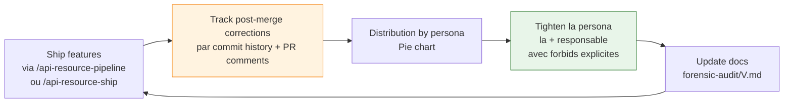

# Forensic audit template

> Pattern "ship → measure → tighten" pour faire évoluer les personas dans le temps.

## Le principe

Une fois que tu ships des features avec le pipeline, **mesure** les corrections post-merge utilisateur. Identifie **quelle persona** est la plus responsable. **Resserre-la** avec des règles explicites issues des cas observés. Itère.



## Template d'audit (à adapter)

### `docs/forensic-audit/V<N>.md`

```markdown
# Forensic audit — V<N>

> Date: YYYY-MM-DD
> Period: <N> features shipped via `/api-resource-ship` between <date> and <date>
> Total post-merge corrections: <N>

## Distribution des corrections par persona

| Persona | Corrections | % |
|---|---:|---:|
| api-platform-implementer | 12 | 50% |
| api-platform-architect | 5 | 21% |
| symfony-reviewer | 3 | 13% |
| symfony-tdd-coach | 2 | 8% |
| api-platform-aligned-reviewer | 1 | 4% |
| api-platform-appsec | 1 | 4% |
| **Total** | **24** | **100%** |

## Top patterns observés

### Pattern 1 — `api-platform-implementer` oublie de killer un mutant Infection (5/12)

**Constat**: 5 PRs sur 12 du implementer ont eu une correction post-merge pour ajouter un test qui aurait été killé par Infection si run.

**Cause racine**: l'agent dispatched `gerard:api-platform-tests` mais ne **lit** pas la skill avant d'écrire les tests. Il infère depuis sa memory.

**Mitigation V<N+1>**:
- Ajouter dans `api-platform-implementer.md` :
  > "Avant d'écrire un test, tu DOIS Read `gerard:api-platform-tests/reference.md` ET produire un block `===EVIDENCE-INFECTION===` qui prouve que tu as run Infection localement."

### Pattern 2 — `api-platform-architect` plan sans test matrix sur les AC d'erreur (3/5)

**Constat**: 3 plans architecte sur 5 corrigés post-merge ont des test matrices qui ne couvrent que le happy path. Les AC 401/403/404/422 sont implicites mais pas mappés.

**Cause racine**: la persona dit "test matrix obligatoire" mais ne dit pas "couvre **explicitement** 401/403/404/422".

**Mitigation V<N+1>**:
- Ajouter dans `api-platform-architect.md` :
  > "La test matrix DOIT inclure une ligne explicite par code HTTP attendu : 200, 201, 401, 403, 404, 422, 409 (si unicité). Pas d'AC implicite."

### Pattern 3 — `symfony-reviewer` rate-limit check inconsistent (2/3)

**Constat**: ...

**Cause racine**: ...

**Mitigation V<N+1>**: ...

## Changes shipped dans V<N+1>

- `agents/api-platform-implementer.md` : ajout règle "Read skill before write + EVIDENCE-INFECTION"
- `agents/api-platform-architect.md` : ajout règle "test matrix explicit HTTP codes"
- `agents/symfony-reviewer.md` : règle #41 rate-limit explicit

## Next audit

- Period: <next-date>
- Goal: measure if patterns 1, 2, 3 dropped to < 10% of corrections
```

## Mesurer — comment ?

### A. Manuel (recommandé en début)

Après chaque PR mergée via `/api-resource-ship`, garder une liste :
- Quel agent a produit le code corrigé ?
- Quelle catégorie de correction ? (anti-pattern API Platform / test manquant / KISS over-engineering / etc.)
- Quel temps de correction ?

Tu peux maintenir un fichier `docs/forensic-audit/log.md` avec une ligne par correction. Une fois N=20+ entries, fais un audit V<X>.

### B. Semi-automatique (avancé)

Un script qui parse `git log --grep="fix:"` ou `git log --grep="post-merge"` et croise avec les `.claude/last-api-*.md` checkout-és du commit qui a shippé. Possible mais lourd.

### C. Periodique

Une fois par sprint / mois / trimestre selon la cadence, faire un audit. Ne pas attendre 6 mois (les patterns dérivent et tu oublies les causes).

## Resserrer — comment ?

### Pattern 1 : ajouter une règle explicite avec source citée

Dans la persona la + responsable, ajouter :

```markdown
## ⛔ Audit V<N> — règle issue de <N> corrections observées

**Pattern**: <description>
**Forbids**: <ce qui est interdit>
**How to verify**: <comment vérifier>
**Source**: see `docs/forensic-audit/V<N>.md` section "Pattern X"
```

### Pattern 2 : muscler la skill associée

Si l'agent dispatchait mal une skill, **enrichir la skill** plutôt que (ou en plus de) muscler l'agent.

Exemple : si le mauvais filter pattern apparaît, enrichir `gerard:api-platform-filters/reference.md` avec une section "Common mistakes audit V<N>".

### Pattern 3 : ajouter un guard automatique

Si un anti-pattern est détectable par regex, ajouter une règle dans `scripts/lint_skill_content.ts` ou un guard CI dédié dans le projet consumer.

Exemple : un projet peut ajouter `bin/ci/check-no-bare-novalidate` (ou équivalent) pour catch un anti-pattern récurrent.

## Garder la mémoire dans le temps

Toutes les audits successifs sont conservés. Un audit V3 dit :
- "Pattern 1 de V1 : <X>% des corrections → V2 a baissé à <Y>% → V3 stable / baissé encore / réapparu"

Ça permet de mesurer **l'effectivité** des règles ajoutées.

## Exemple type d'audit V1 → V2

Camembert type observé après une première vague de shipping :

```
lead-developer       17 corrections
architect            10
gatekeeper            4
system                4
sdet                  3
design-system         2
appsec                1
aligned-architect     0
```

Action V2 : `lead-developer.md` (ou la persona équivalente la plus blamée) resserrée avec **N nouveaux interdits explicites** issus des cas observés (coverage exclusion, mutation per-target, BDD naming, Composer correctness, services.yaml recipe-default, CI step ordering, Boy Scout config-file deny-list, Skill dispatch verification).

Résultat attendu (à mesurer dans V2) : la persona dominante voit sa blame distribution divisée par 2 ou plus.

## Anti-patterns du forensic loop

- ❌ Audit "tout le monde a fait des erreurs" sans identifier la persona dominante → pas d'action
- ❌ Resserrer une persona sans citer la source (le pattern observé) → règle arbitraire qui sera ignorée
- ❌ Ajouter 30 règles dans une persona en V2 → persona devient illisible, les agents la skip
- ❌ Audit qui n'évalue pas l'effectivité des règles V1 dans V2 → on accumule du dead weight
- ❌ Pas d'audit du tout → on continue à shipper les mêmes erreurs

## Voir aussi

- [`pipeline-overview.md`](pipeline-overview.md) — où les corrections sont mesurées
- [`agentic-personas.md`](agentic-personas.md) — où elles sont appliquées
