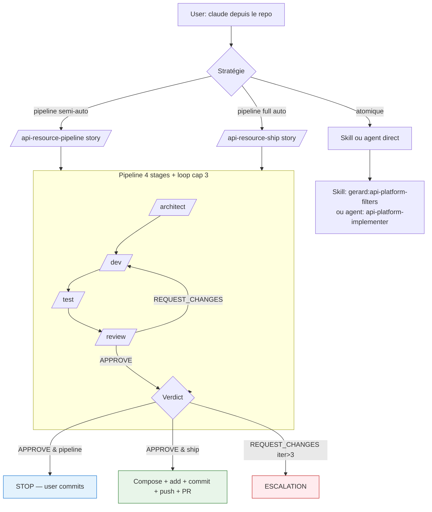
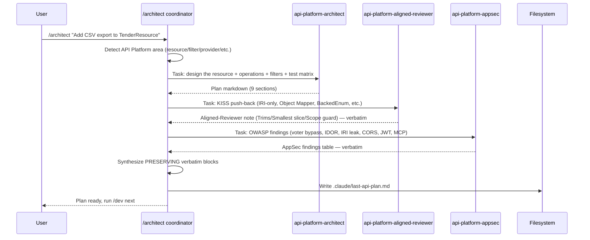
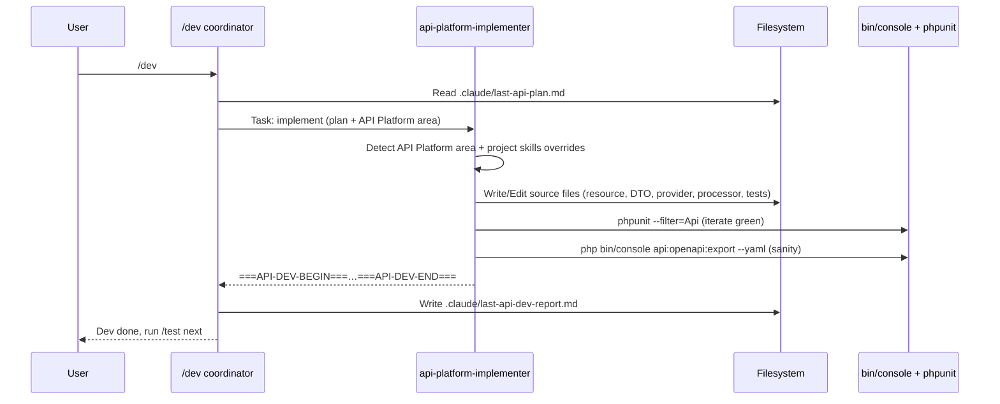
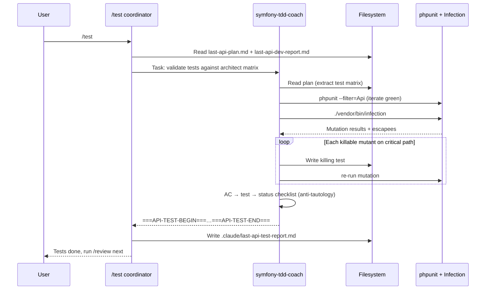
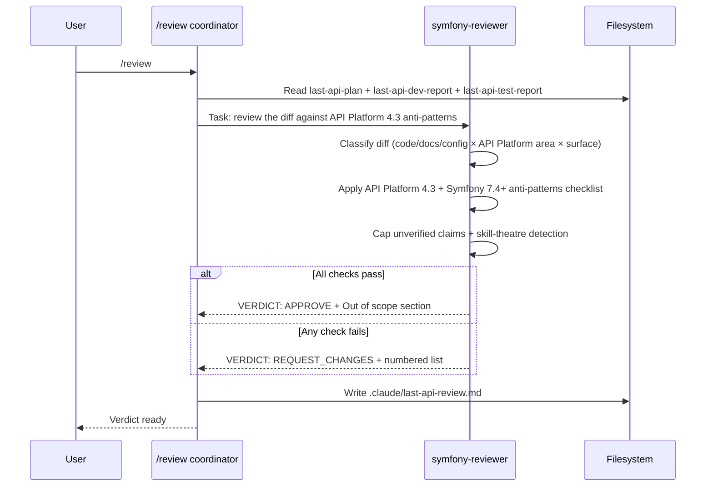
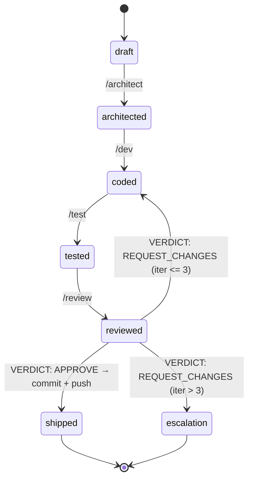
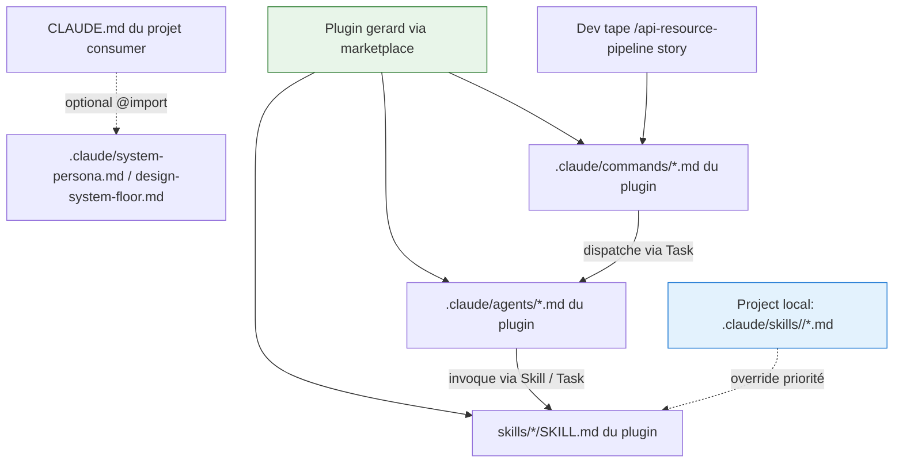

# Pipeline overview (vibecode host)

> **Mode**: vibecode host only. `claude` lancé localement, slash commands drivent les stages.

## Vue d'ensemble

7 agents Task-callable + 7 slash commands de pipeline (en plus des skills classiques). Le pipeline staged peut être invoqué stage-par-stage ou en chain via `/api-resource-pipeline` (semi-auto) / `/api-resource-ship` (full auto avec commit + push + PR).



## Les 4 stages en détail

### Architecture stage (`/architect`)

3 personas dispatchés en parallèle, synthèse avec préservation verbatim.



### Dev stage (`/dev`)

Un seul persona, `api-platform-implementer`, lit le plan et code.



### Test stage (`/test`)

`symfony-tdd-coach` lit la test matrix de l'architecte et valide AC × test mapping.



### Review stage (`/review`)

`symfony-reviewer` est le gatekeeper. Il dispatche d'abord la skill `review` puis évalue.



## State machine (vibecode host)



En mode `/api-resource-pipeline` / `/api-resource-ship`, le coordinator implémente cette state machine côté slash command (cap dur de 3 itérations).

## Composition prompts (mode host)

Pas de `--append-system-prompt`, pas de `--agents` JSON. Tout passe par les fichiers `.claude/` et les `@import` Claude Code :



## Authority order

Voir `agentic-personas.md` pour l'application aux agents.

```
1. Project CLAUDE.md           ← Hard Rules locales du projet consumer
2. Stage personas              ← agents dispatchés par stage
3. Project skills layer         ← <project>:X overrides gerard:X
4. Plugin canonical skills      ← gerard:* (canon API Platform 4.3 + Symfony 7.4+)
```

## Garde-fous

| Garde-fou | Source |
|---|---|
| Cap REQUEST_CHANGES | Cap dur de 3 dans `/api-resource-pipeline` et `/api-resource-ship` |
| Refus sur dirty tree | Pre-flight `/api-resource-ship` |
| Toujours feature branch | Pre-flight `/api-resource-ship` |
| `--no-verify` denied | Recommandé dans le `.claude/settings.json` du projet consumer |
| `--force` denied | Idem |
| Explicit `git add` | Coordinator `/api-resource-ship` |
| Skip `.env`, `*.local.*`, `*.pem`, `*.key` | Coordinator `/api-resource-ship` |
| Marker required | Coordinator écrit dans `.claude/last-api-*.md` |
| Verdict strict | Première ligne non vide = exactement `VERDICT: APPROVE` ou `VERDICT: REQUEST_CHANGES` |

## Voir aussi

- [`agentic-personas.md`](agentic-personas.md) — détail des 7 agents
- [`state-files-protocol.md`](state-files-protocol.md) — convention `.claude/last-api-*.md`
- [`marker-protocol.md`](marker-protocol.md) — format `===STAGE-BEGIN===`
- [`project-skills-pattern.md`](project-skills-pattern.md) — couche skills projet local
- [`forensic-audit-template.md`](forensic-audit-template.md) — pattern ship → measure → tighten
- [`api-platform-anti-patterns.md`](api-platform-anti-patterns.md) — checklist embarquée dans `symfony-reviewer`
