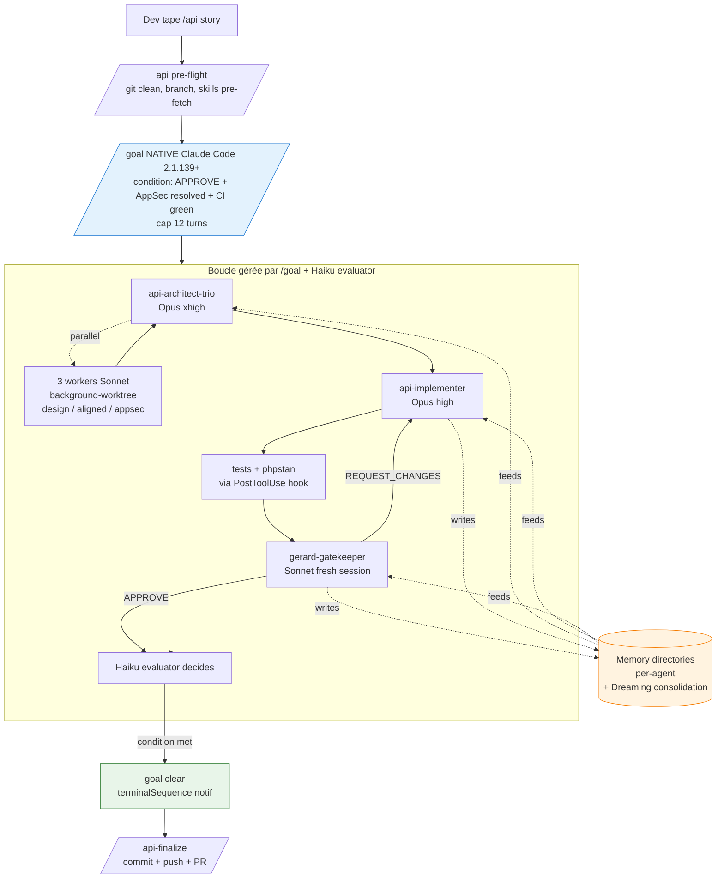

# Plan v1.0 — Big Bang Rebuild

> **Document de référence canonique** pour le big bang v0.1 → v1.0 du plugin gerard (superpowers-api-platform).
>
> **Lis ce document EN PREMIER** quand tu reprends le travail dans une session Claude Code ultérieure. Toutes les décisions sont verrouillées ici, avec leur rationale.

**Auteur** : Session 1 (rédaction), validé par l'utilisateur.
**Date** : 2026-05-14.
**Branche cible** : `v1.0` (créée depuis `main`, merge prévu à la fin du big bang avec tag `v1.0.0`).

---

## 0. Quick context (60 secondes pour reprendre)

Le plugin v0.1 actuel a 25 commandes, 7 agents, 53 skills, 1 hook, et beaucoup de markdown d'orchestration custom (state files, marker protocol, REQUEST_CHANGES loop hard-codé). Cette infrastructure a été conçue avant que Claude Code ne ship `/goal`, auto-memory, background agents avec worktree, hooks lifecycle complet, multi-model orchestration.

v1.0 est un **big bang total** qui :
- **Supprime ~60% du markdown** (coordinators, state files, marker protocol, 22 commandes legacy)
- **Exploite à fond les primitives Claude Code 2026** (5 hooks, 3 agents avec memory + Dreaming, `/goal` natif, multi-model)
- **Ne casse rien côté skills** (50 skills consolidés depuis 53, doctrine intacte)
- **Reste mono-plugin, Claude-only** (pas de split, pas de multi-channel, pas de cloud features)

User-facing : tu passes de **25 commandes** à **3** (`/api`, `/api-finalize`, `/api-doctrine`).

---

## 1. Décisions verrouillées (avec rationale)

Toutes ces décisions ont été validées par l'utilisateur via AskUserQuestion. Ne pas les relitigér sans signal explicite.

### Stratégie globale

| # | Décision | Valeur | Rationale |
|---|---|---|---|
| 1 | Stratégie release | **Big bang total** | Pas de back-compat avec v0.1. Coordinators et stages commands supprimés net. |
| 2 | Structure | **Mono-plugin** | Refusé : split canon/pipeline (ajoutait friction sans bénéfice prouvé). |
| 3 | Focus | **Claude-only depth** | Refusé : multi-channel skills universels. User préfère exploiter Claude features à fond plutôt qu'avoir une reach multi-tools. |
| 4 | Cloud features | **Aucune** | Refusé : ultrareview, Routines, dépendance `claude -p` plan-user. Plugin 100% local interactif. |
| 5 | Approche v1.0 | **Deep Claude-native** | Choisi : exploiter 5+ primitives Claude 2026 (hooks lifecycle, memory dirs, Dreaming, multi-model, /goal). Pas "atomic minimum". |

### Architecture

| # | Décision | Valeur | Rationale |
|---|---|---|---|
| 6 | Agents count | **3** (architect-trio + implementer + gatekeeper) | Evidence-backed depuis research (multi-agent + hallucination studies). +15-25% bugs catchés via gatekeeper adversarial fresh session. -40-50% time via parallel dispatch architect-trio. |
| 7 | Agent memory | **Memory directories par agent + Dreaming** | Forensic loop automatique. Chaque agent accumule des findings spécifiques à son rôle. Dreaming consolide entre sessions. |
| 8 | Hooks count | **5 en bash pur** | SessionStart + UserPromptSubmit + PreToolUse + PostToolUse + Stop. Chacun avec un job précis. |
| 9 | MCP server | **DROPPED** | Initialement proposé, retiré. Bash hooks couvrent les mêmes besoins sans complexité Node. |
| 10 | Effort-routing | **Skills aware** | Frontmatter avec variants low/high/xhigh. `/api --effort high` charge la doctrine complète. |
| 11 | Stop hook scope | **Minimal — secret block only** | ~10 lignes bash. Anti-patterns vont au gatekeeper (déterministique côté gatekeeper, pas hook). Évite les faux positifs sur skills/api-platform-upgrade/. |

### Multi-model orchestration (explicite)

| Agent / Component | Modèle |
|---|---|
| `api-architect-trio` (lead synthesis) | **Opus 4.7 xhigh** |
| Background workers (design/aligned/appsec) | **Sonnet 4.6** |
| `api-implementer` | **Opus 4.7 high** |
| `gerard-gatekeeper` | **Sonnet 4.6** (fresh-session adversarial) |
| `/goal` evaluator | **Haiku 4.5** (default Claude Code) |

Économie estimée : **-30 à -40% de tokens** vs all-Opus, sans perte de qualité documentée.

### Open questions résolues (sessions précédentes)

| Question | Réponse |
|---|---|
| A. Auto-memory strategy | **M3 hybride** : volatile native par défaut + commandes `/api-doctrine export/import` opt-in pour snapshots versionnables |
| B. Plan mode integration | **Configurable, default = full auto**. `/api "feature"` = full auto. `/api "feature" --interactive` = plan mode après architect-trio. |
| C. /api-finalize | **Séparé** de `/api`. Inspection point garanti. |
| D. Repo strategy | **In-place** sur `gerard-labs/superpowers-api-platform`. Branche v1.0 → merge main → tag v1.0.0. |
| E. Sequencing | **Plan doc d'abord** (cette session 1), puis 6 sessions d'exécution. |

---

## 2. Architecture v1.0 cible

### Vue d'ensemble (mermaid)



### File tree cible

```
gerard v1.0 — deep Claude-native
├── .claude-plugin/
│   ├── plugin.json                          # version 1.0.0
│   └── marketplace.json
├── skills/                                  # ~50 skills, effort-routing aware
│   ├── api-platform-resources/
│   ├── api-platform-dto-resources/
│   ├── api-platform-state-providers/
│   ├── api-platform-state-processors/
│   ├── api-platform-serialization/
│   ├── api-platform-security/
│   ├── api-platform-filters/
│   ├── api-platform-pagination/
│   ├── api-platform-versioning/
│   ├── api-platform-openapi/
│   ├── api-platform-mutators/
│   ├── api-platform-identifiers/
│   ├── api-platform-errors/
│   ├── api-platform-tests/
│   ├── api-platform-performance/
│   ├── api-platform-resilience/
│   ├── api-platform-user/
│   ├── api-platform-file-upload/
│   ├── api-platform-mcp/
│   ├── api-platform-upgrade/
│   ├── symfony-messenger/
│   ├── messenger-retry-failures/
│   ├── symfony-scheduler/
│   ├── symfony-voters/
│   ├── rate-limiting/
│   ├── doctrine-relations/
│   ├── doctrine-migrations/
│   ├── doctrine-fixtures-foundry/
│   ├── doctrine-transactions/
│   ├── doctrine-fetch-modes/
│   ├── doctrine-batch-processing/
│   ├── quality-checks/
│   ├── symfony-cache/
│   ├── controller-cleanup/
│   ├── config-env-parameters/
│   ├── interfaces-and-autowiring/
│   ├── ports-and-adapters/
│   ├── cqrs-and-handlers/
│   ├── value-objects-and-dtos/
│   ├── strategy-pattern/
│   ├── tdd-php/                             # NEW : fusion tdd-with-pest + tdd-with-phpunit
│   ├── functional-tests/
│   ├── test-doubles-mocking/
│   ├── using-symfony-superpowers/
│   ├── runner-selection/
│   ├── makefile-discipline/
│   ├── daily-workflow/                      # absorbe bootstrap-check
│   ├── effective-context/
│   ├── brainstorming/
│   ├── writing-plans/
│   ├── executing-plans/
│   └── meta/
│       ├── anti-patterns-audit/             # NEW : ex /self-audit-api standalone
│       └── goal-patterns/                   # NEW : templates de condition /goal
├── agents/                                  # 3 agents avec memory dirs
│   ├── api-architect-trio/
│   │   ├── agent.md                         # model: opus-4.7-xhigh
│   │   └── memory/
│   │       └── .gitkeep
│   ├── api-implementer/
│   │   ├── agent.md                         # model: opus-4.7-high
│   │   └── memory/
│   │       └── .gitkeep
│   └── gerard-gatekeeper/
│       ├── agent.md                         # model: sonnet-4.6 (fresh-session adversarial)
│       └── memory/
│           └── .gitkeep
├── hooks/
│   ├── hooks.json                           # 5 events déclarés
│   ├── session-start.sh                     # detect env + check CC ≥ 2.1.139
│   ├── user-prompt-submit.sh                # pre-fetch skills depuis keywords /api
│   ├── pre-tool-use.sh                      # 10 lignes secret block
│   ├── post-tool-use.sh                     # regex anti-patterns + auto phpstan
│   └── stop.sh                              # terminalSequence desktop notif
├── commands/                                # 3 user-facing
│   ├── api.md                               # entry unique
│   ├── api-finalize.md                      # commit + push + PR
│   └── api-doctrine.md                      # export/import memory snapshots (M3)
├── docs/
│   ├── overview.md                          # 5-minute read pour tout comprendre
│   ├── how-it-works.md                      # archi détaillée avec mermaid
│   ├── agents.md                            # les 3 agents en profondeur
│   ├── hooks.md                             # ce que chaque hook fait
│   ├── commands.md                          # /api, /api-finalize, /api-doctrine deep
│   ├── skills.md                            # catalog des 50 skills
│   ├── anti-patterns.md                     # source of truth (gatekeeper + post-tool-use)
│   ├── goal-patterns.md                     # 5 templates de condition /goal
│   ├── forensic-loop.md                     # memory + Dreaming explained
│   ├── migration-v0.1.md                    # pour users existants
│   ├── troubleshooting.md                   # FAQ + erreurs courantes
│   └── v1.0-plan.md                         # ce document (référence interne)
├── tests/
│   └── fixtures/
│       └── symfony-test-project/            # mini-projet pour E2E test session 7
├── scripts/
│   ├── validate_skills.ts
│   └── lint_skill_content.ts
├── skills-map.md                            # un seul (lite supprimé)
├── README.md                                # réécrit modern (hero + badges + mermaid + emojis)
├── RELEASE-NOTES.md                         # v1.0 entry + migration link
├── CONTRIBUTING.md
├── LICENSE
├── package.json                             # validators dev deps
└── package-lock.json
```

### Ce qui disparaît (résumé)

- `commands/` : `api-resource-pipeline.md`, `api-resource-ship.md`, `architect.md`, `dev.md`, `test.md`, `review.md`, `self-audit-api.md`, et 13 atomic `/symfony-*` wrappers
- `docs/symfony/` : `state-files-protocol.md`, `marker-protocol.md`, `pipeline-overview.md`, `agentic-personas.md`, `project-skills-pattern.md` (dossier `symfony/` lui-même peut disparaître ou être absorbé dans `docs/`)
- `skills/bootstrap-check/` (absorbé dans daily-workflow)
- `skills-map-lite.md`
- Toutes refs `samurai-build`, `samurai/` exemples (4 emplacements)
- `agents/api-platform-aligned-reviewer.md`, `api-platform-appsec.md` (fusionnés dans api-architect-trio)
- `agents/api-platform-implementer.md` → renommé `api-implementer/agent.md`
- `agents/symfony-tdd-coach.md` (drop comme agent, doctrine migre dans skills tdd-php + api-platform-tests)
- `agents/doctrine-architect.md` (drop comme agent, doctrine migre dans skill `doctrine-design` si créée)
- `agents/symfony-reviewer.md` → renommé `gerard-gatekeeper/agent.md`

---

## 3. Mapping artefact-par-artefact (v0.1 → v1.0)

### 3a. Commands (25 → 3)

| v0.1 | Destin v1.0 |
|---|---|
| `/api-resource-pipeline` | ❌ supprimé. Remplacé par `/api` + /goal natif. |
| `/api-resource-ship` | ❌ supprimé. Workflow git extrait dans `/api-finalize`. |
| `/architect` | ❌ supprimé. Devient agent `api-architect-trio` dispatché en interne par `/api`. |
| `/dev` | ❌ supprimé. Devient agent `api-implementer`. |
| `/test` | ❌ supprimé. Implementer écrit les tests, gatekeeper valide. |
| `/review` | ❌ supprimé. Devient agent `gerard-gatekeeper`. |
| `/self-audit-api` | ❌ supprimé. Devient skill standalone `meta/anti-patterns-audit/`. |
| `/symfony-api-resources`, `-filters`, `-mcp`, `-mutators`, `-errors`, `-upgrade` | ❌ supprimés. Skill tool natif fait `/api-platform-*` direct. |
| `/symfony-voters`, `-messenger`, `-cache`, `-tdd-pest`, `-tdd-phpunit`, `-migrations`, `-fixtures`, `-doctrine-relations`, `-check` | ❌ supprimés. Skill tool natif. |
| `/brainstorm`, `/write-plan`, `/execute-plan` | ❌ supprimés. Skills natives Claude Code (`plan-mode`, `init`) couvrent. |
| `/api` (NEW) | ✅ Entry unique. Pre-flight + /goal scaffolded. |
| `/api-finalize` (NEW) | ✅ Commit + push + gh pr create. |
| `/api-doctrine` (NEW) | ✅ Export/import memory snapshots (M3 hybride). |

### 3b. Agents (7 → 3)

| v0.1 | Destin v1.0 |
|---|---|
| `api-platform-architect` | 🔀 Fusionné dans `api-architect-trio` (dispatch + synthesis) |
| `api-platform-aligned-reviewer` | 🔀 Devient un des 3 background workers dispatched par architect-trio |
| `api-platform-appsec` | 🔀 Devient un des 3 background workers dispatched par architect-trio |
| `api-platform-implementer` | ✏️ Renommé `api-implementer` (raccourci), enrichi avec memory dir |
| `symfony-tdd-coach` | ❌ Drop comme agent. Doctrine migre dans skills `tdd-php` + `api-platform-tests`. Implementer écrit les tests directement. |
| `symfony-reviewer` | ✏️ Renommé `gerard-gatekeeper`, enrichi avec memory dir + Sonnet 4.6 explicit |
| `doctrine-architect` | ❌ Drop comme agent. Skill `doctrine-design` créée si besoin (à évaluer session 5). |

### 3c. Skills (53 → ~50)

**Fusions** :
- `tdd-with-pest` + `tdd-with-phpunit` → `tdd-php` (deux sections par framework dans un seul SKILL.md)

**Absorbés** :
- `bootstrap-check` → contenu intégré dans `daily-workflow/`

**Ajoutés** :
- `meta/anti-patterns-audit/` — skill standalone pour audit hors-pipeline (ex /self-audit-api)
- `meta/goal-patterns/` — templates de condition `/goal` (5 patterns : feature, refactor, migration, hardening, docs-only)
- (optionnel session 5) `doctrine-design/` — si la doctrine architect agent est jugée nécessaire en skill

**Inchangés** : les 49 autres skills (consolidation effort-routing en session 5, contenu doctrinal préservé).

**Effort-routing frontmatter** (à ajouter session 5 sur tous les skills) :

```yaml
---
name: api-platform-resources
description: Triggers on ApiResource, operations, IRI-only, subresources
effort-routing:
  low: SKILL.md         # version courte ~30 lignes
  high: reference.md    # version complète ~300 lignes
  xhigh: reference.md + examples/*.php
---
```

### 3d. Hooks (1 → 5)

| Hook | Trigger | Job |
|---|---|---|
| `session-start.sh` | SessionStart | Detect env (Symfony/AP version, runner type, Make targets, Claude Code version) → JSON output |
| `user-prompt-submit.sh` | UserPromptSubmit | Si prompt start `/api`, parse keywords → pre-fetch skills correspondantes |
| `pre-tool-use.sh` | PreToolUse | Block writes de `.env*`, `*.pem`, `*.key`, `*credentials*`, `*.p12`, `*.pfx` |
| `post-tool-use.sh` | PostToolUse | Sur Write/Edit `*.php` : regex anti-patterns + `phpstan analyse $file` |
| `stop.sh` | Stop | terminalSequence desktop notif "Goal cleared: $BRANCH ready for /api-finalize" |

### 3e. Docs (overhaul complet)

Voir section 5 (Session 6) pour le détail.

---

## 4. Phases d'exécution (7 sessions)

### Session 1 — Plan doc (CETTE session)

- ✅ Branche `v1.0` créée
- ✅ `docs/v1.0-plan.md` rédigé (ce document)
- ⏳ Commit + memory handoff

**Exit criteria** : user valide le plan doc, on peut passer à Session 2.

### Session 2 — Cleanup + structure

**Objectif** : supprimer artefacts morts, créer structure cible vide.

**Checklist actionnable** :

```
□ Read docs/v1.0-plan.md
□ Read memory/session-1-completed.md
□ git status (clean attendu)

□ Suppressions commands/ :
  □ rm commands/api-resource-pipeline.md
  □ rm commands/api-resource-ship.md
  □ rm commands/architect.md
  □ rm commands/dev.md
  □ rm commands/test.md
  □ rm commands/review.md
  □ rm commands/self-audit-api.md
  □ rm commands/symfony-api-resources.md
  □ rm commands/symfony-api-filters.md
  □ rm commands/symfony-api-mcp.md
  □ rm commands/symfony-api-mutators.md
  □ rm commands/symfony-api-errors.md
  □ rm commands/symfony-api-upgrade.md
  □ rm commands/symfony-voters.md
  □ rm commands/symfony-messenger.md
  □ rm commands/symfony-cache.md
  □ rm commands/symfony-tdd-pest.md
  □ rm commands/symfony-tdd-phpunit.md
  □ rm commands/symfony-migrations.md
  □ rm commands/symfony-fixtures.md
  □ rm commands/symfony-doctrine-relations.md
  □ rm commands/symfony-check.md
  □ rm commands/brainstorm.md
  □ rm commands/write-plan.md
  □ rm commands/execute-plan.md

□ Suppressions agents/ :
  □ rm agents/api-platform-aligned-reviewer.md (logique migre dans trio)
  □ rm agents/api-platform-appsec.md (idem)
  □ rm agents/symfony-tdd-coach.md
  □ rm agents/doctrine-architect.md

□ Suppressions docs/symfony/ :
  □ rm docs/symfony/state-files-protocol.md
  □ rm docs/symfony/marker-protocol.md
  □ rm docs/symfony/pipeline-overview.md
  □ rm docs/symfony/agentic-personas.md
  □ rm docs/symfony/project-skills-pattern.md
  □ rm docs/symfony/forensic-audit-template.md (refait en docs/forensic-loop.md session 6)
  □ rm docs/symfony/README.md (refait via docs/overview.md session 6)

□ Suppressions skills/ :
  □ rm -rf skills/bootstrap-check (absorbé dans daily-workflow session 5)

□ Suppressions misc :
  □ rm skills-map-lite.md (gardera juste skills-map.md)

□ Nettoyage samurai :
  □ Edit hooks/session-start.sh:50 — remplacer "samurai/symfony/" par "<project>/symfony/" dans commentaire
  □ Edit skills/runner-selection/reference.md lignes 46, 139 — remplacer "samurai/" par exemple neutre
  □ Edit skills/makefile-discipline/reference.md lignes 104, 157, 158 — idem
  □ Edit RELEASE-NOTES.md ligne 95 — retirer mention samurai-build

□ Création structure cible :
  □ mkdir agents/api-architect-trio/memory && touch agents/api-architect-trio/memory/.gitkeep
  □ mkdir agents/api-implementer/memory && touch agents/api-implementer/memory/.gitkeep
  □ mkdir agents/gerard-gatekeeper/memory && touch agents/gerard-gatekeeper/memory/.gitkeep
  □ mkdir skills/meta/anti-patterns-audit
  □ mkdir skills/meta/goal-patterns
  □ mkdir tests/fixtures (création anticipée session 7)

□ Renommages (déplacements avec git mv pour préserver l'historique) :
  □ git mv agents/api-platform-implementer.md agents/api-implementer/agent.md
  □ git mv agents/api-platform-architect.md agents/api-architect-trio/agent.md (sera réécrit session 3)
  □ git mv agents/symfony-reviewer.md agents/gerard-gatekeeper/agent.md

□ Update .gitignore : valider que .claude/last-api-*.md reste ignored (legacy protection)

□ Commit "v1.0: cleanup phase 2 — remove legacy orchestration & samurai refs"

□ Write memory/session-2-completed.md (handoff pour session 3)
```

**Exit criteria** : `git status` clean, structure cible présente, ancienne orchestration purgée.

### Session 3 — Agents v1.0

**Objectif** : réécrire les 3 agents avec multi-model + memory dirs.

**Checklist actionnable** :

```
□ Read docs/v1.0-plan.md
□ Read memory/session-2-completed.md
□ git log --oneline -10 (vérifier état)

□ Réécrire agents/api-architect-trio/agent.md :
  □ Frontmatter : model: opus-4.7-xhigh, effort: high, maxTurns: 25
  □ Description : "Architecture stage — dispatches design + aligned + appsec en parallèle (background-worktree), synthesizes plan with verbatim preservation"
  □ Sections :
    □ Workflow : 3 background Agent calls (Sonnet 4.6) en parallel avec isolation: "worktree"
    □ Monitor tool pour await les 3 returns
    □ Synthesis preserving verbatim Aligned-Reviewer + AppSec blocks
    □ Read memory/ avant de commencer (lessons learned du projet)
    □ Write memory/ à la fin (nouveaux patterns observés)
    □ Output : plan markdown direct (pas de marker protocol, retour Task suffit)
    □ Embed les anciennes doctrines de architect + aligned + appsec (les 3 personas v0.1)

□ Réécrire agents/api-implementer/agent.md :
  □ Frontmatter : model: opus-4.7-high, effort: high, maxTurns: 35
  □ Description : "Dev stage — implements the plan, writes code + tests + applies AppSec mitigations"
  □ Sections :
    □ Read memory/ first (patterns observés sur ce projet)
    □ Workflow : implement + run phpunit + phpstan + (PostToolUse hook intercepte aussi)
    □ Definition of Done 10 items (récupéré de v0.1 api-platform-implementer)
    □ Anti-patterns auto-reject (récupéré de v0.1)
    □ Skill dispatch verification (les Skill() calls réels)
    □ Write memory/ : patterns implementation observés

□ Réécrire agents/gerard-gatekeeper/agent.md :
  □ Frontmatter : model: sonnet-4.6, effort: high, maxTurns: 20
  □ Description : "Review stage — adversarial fresh-session reviewer. 24+ anti-patterns checklist. VERDICT strict format."
  □ Sections :
    □ Read memory/ first (anti-patterns historique catchés)
    □ Diff classification preamble (diff type / API Platform area / surface / operation type)
    □ ===EVIDENCE=== block obligatoire
    □ 16 API Platform 4.3 + 8 Symfony 7.4+ + tests + appsec rules (récupéré de v0.1 symfony-reviewer)
    □ AI-slop check
    □ Verdict strict première ligne
    □ Out-of-scope mandatory on APPROVE
    □ Write memory/ : anti-patterns nouveaux observés

□ Validate :
  □ Run scripts/validate_skills.ts (vérifier que les frontmatters parsent)
  □ Vérifier que les 3 agents.md ont les bons modèles déclarés
  □ Vérifier que les chemins memory/ existent (.gitkeep en place)

□ Commit "v1.0: agents phase 3 — 3 specialized agents with memory dirs + multi-model"

□ Write memory/session-3-completed.md
```

**Exit criteria** : 3 agents.md valides, validators green.

### Session 4 — Hooks + Commands

**Objectif** : 5 hooks bash + 3 commandes user-facing.

**Checklist actionnable** :

```
□ Read docs/v1.0-plan.md
□ Read memory/session-3-completed.md

□ Update hooks/hooks.json :
  □ Déclarer 5 events : SessionStart, UserPromptSubmit, PreToolUse, PostToolUse, Stop
  □ Chaque hook pointe vers son script .sh

□ hooks/session-start.sh :
  □ Garder logique existante (detect Symfony/AP version, runner type, Make)
  □ Ajouter : check Claude Code version ≥ 2.1.139, warn si inférieur
  □ Output JSON avec context env

□ hooks/user-prompt-submit.sh :
  □ Lire prompt depuis stdin (JSON)
  □ Si prompt starts /api : parse $ARGUMENTS keywords
  □ Map keywords → skills à pré-load
    □ "filter|search|sort" → api-platform-filters
    □ "mcp" → api-platform-mcp
    □ "upload|file|multipart" → api-platform-file-upload
    □ "security|jwt|oidc|cors" → api-platform-security
    □ etc. (tableau dans le script)
  □ Output : suggestion skills à charger

□ hooks/pre-tool-use.sh :
  □ Lire tool call depuis stdin
  □ Si tool=Write : check file path matches secret pattern (.env*|*.pem|*.key|*.p12|*.pfx|*credentials*)
  □ Si match : echo "BLOCK: secret file" + exit 2
  □ Sinon : exit 0

□ hooks/post-tool-use.sh :
  □ Lire tool result depuis stdin
  □ Si tool=Write|Edit et file=*.php :
    □ Run regex check sur le fichier (16 anti-patterns)
    □ Si anti-pattern trouvé : echo block message + exit 2
    □ Sinon : run phpstan analyse $file (avec timeout 30s)
    □ Si phpstan errors : echo summary + exit 2
  □ Si tout OK : exit 0

□ hooks/stop.sh :
  □ Lire goal status depuis env (CLAUDE_GOAL_STATUS si dispo)
  □ Si goal_cleared=true : emit terminalSequence notif "Goal: $BRANCH ready for /api-finalize"
  □ Output : exit 0

□ commands/api.md :
  □ Frontmatter : description, argument-hint, allowed-tools
  □ Body :
    □ Pre-flight bash (git clean check, story shape detect, branch checkout)
    □ Compose /goal condition depuis skills/meta/goal-patterns/ (template selon story shape)
    □ Support flag --interactive : si présent, inject plan-mode step après architect-trio
    □ Launch /goal natif
    □ Final output : notify user de /api-finalize

□ commands/api-finalize.md :
  □ Frontmatter
  □ Body :
    □ git status --porcelain (assert non vide)
    □ Compose commit message (subject + body depuis context)
    □ Stage explicite par fichier (skip secrets, skip last-api-*.md legacy)
    □ git commit (no --amend, no --no-verify)
    □ git push -u origin <current-branch>
    □ gh pr create (si gh installé) avec template
    □ Output final report

□ commands/api-doctrine.md :
  □ Frontmatter
  □ Body :
    □ Subcommand: export <name>
      □ Read auto-memory entries pertinentes (feedback type, source des 3 agents)
      □ Write .claude/memory-snapshots/<name>.md
      □ Output : "Snapshot exported. Commit it to share with team."
    □ Subcommand: import <name>
      □ Read .claude/memory-snapshots/<name>.md
      □ Append entries to auto-memory
      □ Output : "Snapshot imported. Active for this session."
    □ Subcommand: list
      □ List existing snapshots

□ Commit "v1.0: hooks + commands phase 4"

□ Write memory/session-4-completed.md
```

**Exit criteria** : 5 hooks bash parsent sans erreur (test : `bash -n hook.sh`), 3 commands rendent.

### Session 5 — Skills consolidation

**Objectif** : 53 → 50 skills, effort-routing aware.

**Checklist actionnable** :

```
□ Read docs/v1.0-plan.md
□ Read memory/session-4-completed.md

□ Fusion tdd skills :
  □ Créer skills/tdd-php/SKILL.md (merge tdd-with-pest + tdd-with-phpunit)
    □ Description : "TDD with Pest or PHPUnit"
    □ Sections : "Avec Pest" + "Avec PHPUnit" + "Choix framework"
  □ Créer skills/tdd-php/reference.md (consolidé)
  □ git rm -rf skills/tdd-with-pest
  □ git rm -rf skills/tdd-with-phpunit

□ Absorbe bootstrap-check :
  □ Merge skills/bootstrap-check/* dans skills/daily-workflow/
  □ git rm -rf skills/bootstrap-check (déjà fait session 2 ?)

□ Crée skills/meta/anti-patterns-audit/SKILL.md :
  □ Description : "Audit current diff against API Platform 4.3 + Symfony 7.4+ anti-patterns"
  □ Content : checklist Y/N (récupéré de l'ancien /self-audit-api command)

□ Crée skills/meta/goal-patterns/SKILL.md :
  □ Description : "Goal condition templates for /api"
  □ Content : 5 templates (feature, refactor, migration, hardening, docs-only) avec placeholders

□ Effort-routing — ajoute frontmatter dans tous les skills :
  □ Pour chaque skill avec un reference.md :
    □ Ajoute :
      effort-routing:
        low: SKILL.md
        high: reference.md
        xhigh: reference.md + examples/*

  □ Pour skills sans reference.md (juste SKILL.md) :
    □ Pas de routing nécessaire (toujours charge SKILL.md)

□ Update skills-map.md :
  □ Liste les 50 skills consolidés
  □ Note les fusions explicitement

□ Run validators :
  □ npx tsx scripts/validate_skills.ts
  □ npx tsx scripts/lint_skill_content.ts
  □ Fix les errors observées

□ docs/anti-patterns.md (création) :
  □ Source of truth canonique (récupéré de docs/symfony/api-platform-anti-patterns.md)
  □ 16 AP rules + 8 Symfony rules + AppSec + tests rules
  □ Sera lue par gerard-gatekeeper et post-tool-use.sh

□ docs/goal-patterns.md (création) :
  □ Les 5 templates explicités avec exemples

□ Commit "v1.0: skills consolidation phase 5"

□ Write memory/session-5-completed.md
```

**Exit criteria** : `npm run check` passe sans erreur, 50 skills validés.

### Session 6 — Docs big bang

**Objectif** : doc complète modern avec mermaid, badges, emojis, overview accessible.

**Checklist actionnable** :

```
□ Read docs/v1.0-plan.md
□ Read memory/session-5-completed.md

□ README.md complete rewrite :
  □ Hero section avec tagline (1 phrase qui résume la valeur)
  □ Badges (https://shields.io) :
    □ License MIT
    □ Plugin version (1.0.0)
    □ Claude Code requirement (≥ 2.1.139)
    □ API Platform version (4.3+)
    □ Symfony version (7.4+ LTS)
    □ PHP version (8.2+)
  □ GIF/screenshot du flow /api (peut être texte ascii art si pas de capture)
  □ Quick Start (3 commandes) :
    □ /plugin marketplace add gerard-labs/superpowers-api-platform
    □ /plugin install gerard@superpowers-api-platform
    □ /api "Add Product resource"
  □ Mermaid graph du flow v1.0 (récupéré de section 2 de ce plan)
  □ Features table avec emojis :
    □ 🤖 3 agents spécialisés (architect-trio / implementer / gatekeeper)
    □ 🪝 5 hooks deterministic enforcement
    □ 📚 50 skills doctrinales (API Platform 4.3 + Symfony 7.4+)
    □ ⚡ Multi-model orchestration (Opus / Sonnet / Haiku)
    □ 🧠 Memory per-agent + Dreaming
    □ 🎯 /goal native loop
    □ 🛡️ Anti-patterns enforcement (déterministique)
    □ 🚀 -80% lignes de coordinator vs v0.1
  □ Tables :
    □ 3 agents (rôle, modèle, contexte)
    □ 5 hooks (event, job)
    □ 50 skills (top 10 + lien vers skills.md)
  □ Sections :
    □ Installation
    □ Quick example walkthrough
    □ Documentation links (overview, how-it-works, agents, hooks, etc.)
    □ Migration v0.1 → v1.0 (link)
    □ Contributing
    □ License

□ docs/overview.md (5-minute read) :
  □ 🎯 What it does (1 paragraphe)
  □ ⚡ How /api works (mermaid + 3 phrases)
  □ 🤖 The 3 agents (1 ligne chacun + link)
  □ 🪝 The 5 hooks (1 ligne chacun + link)
  □ 🧠 The forensic loop (memory + Dreaming, 1 paragraphe + link)
  □ 🚀 Get started (3 commandes)

□ docs/how-it-works.md :
  □ Architecture détaillée
  □ Mermaid sequence diagrams pour chaque stage
  □ Multi-model orchestration explained
  □ Pourquoi ces 3 agents (et pas 5 ou 7) — references aux études CORE, hallucination research
  □ Pourquoi Stop hook minimal

□ docs/agents.md :
  □ Pour chaque agent : rôle, modèle, inputs/outputs, memory pattern
  □ Schémas si pertinent

□ docs/hooks.md :
  □ Pour chaque hook : trigger, job, exemple, comment overrider

□ docs/commands.md :
  □ /api : full reference, examples, flags (--interactive, --effort)
  □ /api-finalize : full reference
  □ /api-doctrine : export/import/list

□ docs/skills.md :
  □ Catalog des 50 skills organisé par domaine (table)
  □ Lien vers chaque SKILL.md

□ docs/forensic-loop.md :
  □ Comment memory directories accumulent
  □ Comment Dreaming consolide
  □ Comment /api-doctrine export/import sert au sharing
  □ Patterns observés (template pour les users qui veulent contribuer)

□ docs/migration-v0.1.md :
  □ Étapes user pour migrer
  □ Mapping commandes v0.1 → v1.0
  □ FAQ migration

□ docs/troubleshooting.md :
  □ "Goal doesn't clear" : check evaluator, hooks
  □ "Hook blocks unexpectedly" : check secrets patterns
  □ "Agents fail to dispatch" : check Claude Code version
  □ "Memory not persisting" : check auto-memory location

□ RELEASE-NOTES.md :
  □ v1.0.0 entry avec :
    □ Highlights (Big bang, deep Claude-native)
    □ Breaking changes (liste exhaustive)
    □ Migration link
    □ Acknowledgments

□ CONTRIBUTING.md :
  □ Update si nécessaire (skills format, agents format, etc.)

□ Visual checks :
  □ Render README sur GitHub (preview) — badges + mermaid + tables ok
  □ Verify all internal links

□ Commit "v1.0: docs big bang phase 6"

□ Write memory/session-6-completed.md
```

**Exit criteria** : tous les docs rendent correctement, README looks modern (hero + badges + mermaid), overview compris en 5 min par un nouveau lecteur.

### Session 7 — Test autonome + release

**Objectif** : E2E test sur fixture, release candidate.

**Checklist actionnable** :

```
□ Read docs/v1.0-plan.md
□ Read memory/session-6-completed.md

□ Setup fixture Symfony 7.4 + AP 4.3 :
  □ cd tests/fixtures/
  □ composer create-project symfony/skeleton symfony-test-project "^7.4"
  □ cd symfony-test-project
  □ composer require api-platform/symfony "^4.3" symfony/orm-pack doctrine/dbal
  □ Config SQLite (DATABASE_URL env)
  □ Crée une entity de base (User) pour avoir un truc à étendre
  □ Commit la fixture en .gitignore vendor/

□ Test 1 : Happy path
  □ Dans terminal : cd tests/fixtures/symfony-test-project && claude
  □ /plugin install local (charger depuis le repo parent)
  □ /api "Add Product resource with name, price, status BackedEnum (DRAFT/PUBLISHED/ARCHIVED)"
  □ Observe :
    □ Pre-flight passe (git clean, branch créée)
    □ architect-trio dispatche
    □ 3 background workers fire (vérifier dans logs ou Monitor)
    □ Plan synthétisé
    □ implementer code Product entity + ApiResource + tests
    □ PostToolUse hook auto-run phpstan (observer dans tool stream)
    □ gatekeeper review
    □ /goal evaluator clear quand VERDICT: APPROVE
  □ git diff : valide le code
  □ Report : ✅/❌

□ Test 2 : Anti-pattern catch
  □ /api "Add a Tender resource with #[ApiFilter(SearchFilter::class)] (legacy)"
  □ Observe :
    □ PostToolUse hook bloque (regex detect #[ApiFilter])
    □ Implementer corrige vers parameters: [QueryParameter] pattern
    □ Goal clear après iteration
  □ Report

□ Test 3 : Secret protection
  □ Force implementer à tenter d'écrire .env.local (via prompt explicit)
  □ Observe :
    □ PreToolUse hook bloque
    □ Implementer doit utiliser .env.dist
  □ Report

□ Test 4 : Memory accumulation
  □ /api "Add Category resource" (similar pattern à Product)
  □ Observe :
    □ implementer memory/ a une entry de Test 1
    □ Le run 2 est plus rapide ou plus aligné (mesurer si possible)
  □ Report

□ Test 5 : /api-finalize dry-run
  □ Après Test 1 clear
  □ /api-finalize (sans push réel, dry-run mode si supporté)
  □ Observe :
    □ Commit message composé correctement
    □ Stage explicite, skip secrets
    □ Push command output
  □ Report

□ Write tests/test-report-v1.0.md :
  □ Pour chaque test : ✅/❌ + observations + fixes appliqués
  □ Verdict final : ready / blocked

□ Si bugs trouvés :
  □ Fix iteratively
  □ Re-run test concerné
  □ Update test report

□ Bump version :
  □ Edit .claude-plugin/plugin.json : version "1.0.0"
  □ Edit .claude-plugin/marketplace.json idem
  □ Edit package.json idem si pertinent

□ Final commit "v1.0: E2E test passed, release candidate"

□ Tag :
  □ git tag v1.0.0-rc1 -m "Release candidate v1.0.0-rc1"
  □ Si user valide → tag v1.0.0 (production)

□ Merge dans main (when validated by user) :
  □ git checkout main
  □ git merge --no-ff v1.0
  □ git tag v1.0.0
  □ git push origin main --tags

□ Write memory/session-7-completed.md (final)
```

**Exit criteria** : tous les tests E2E ✅, user valide le tag final, merge dans main.

---

## 5. Mécanique inter-sessions

### a) Memory entries (auto-memory)

Chaque fin de session écrit dans `/home/seb/.claude/projects/.../memory/` :

- `session-N-completed.md` : ce qui a été fait, fichiers touchés, état git, next session
- Update `MEMORY.md` index avec un pointer

Exemple de `session-1-completed.md` (à écrire en fin de cette session) :

```markdown
---
name: session-1-completed
description: Session 1 du big bang v1.0 — plan doc rédigé
metadata:
  type: project
---

Session 1 completed on 2026-05-14.

## What was done
- Branche v1.0 créée depuis main
- docs/v1.0-plan.md rédigé (référence canonique pour toutes les sessions suivantes)

## Files touched
- docs/v1.0-plan.md (created)

## Git state
- On branch v1.0, 1 commit ahead of main
- Last commit: "v1.0: plan doc phase 1"

## Next session (Session 2)
Cleanup + structure. Voir docs/v1.0-plan.md section 4 "Session 2".

## Reference
See [[v1-decisions]] for locked decisions, [[plugin-strategy]] for strategy.
```

### b) Le plan doc comme ancre

`docs/v1.0-plan.md` (ce document) est lu en début de chaque session. C'est la source of truth.

### c) Git workflow

Une branche unique `v1.0`. Chaque session commit son travail. Pas de WIP non commit entre sessions.

Convention de commit message :
- `v1.0: <phase name> phase N — <short desc>`
- Exemple : `v1.0: cleanup phase 2 — remove legacy orchestration & samurai refs`

### d) Démarrage type d'une session

```
1. Read /home/seb/.claude/projects/.../memory/MEMORY.md
2. Read /home/seb/.claude/projects/.../memory/session-<N-1>-completed.md
3. Read docs/v1.0-plan.md (focus sur section 4 de la phase courante)
4. git checkout v1.0 && git log --oneline -10
5. Reprendre la checklist actionnable de la phase courante
```

---

## 6. Test autonome E2E — protocole détaillé

Voir Session 7 ci-dessus (section 4) pour le protocole complet.

Points clefs :
- Fixture Symfony 7.4 + AP 4.3 dans `tests/fixtures/symfony-test-project/`
- 5 scénarios à valider (happy path, anti-pattern, secret, memory, finalize)
- Test report écrit dans `tests/test-report-v1.0.md`
- Bugs trouvés → fix iteratively, max 3 itérations par scénario sinon escalade utilisateur
- Tag rc1 avant validation finale

---

## 7. Migration v0.1 → v1.0 (côté users existants)

Pour les users qui ont v0.1 installé :

```bash
# 1. Pull du marketplace
/plugin marketplace update gerard@superpowers-api-platform

# 2. Update plugin
/plugin update gerard@superpowers-api-platform

# 3. Lire le guide
Read .claude/plugins/marketplaces/gerard@superpowers-api-platform/docs/migration-v0.1.md
```

Changements impactants :

| v0.1 | v1.0 |
|---|---|
| `/architect`, `/dev`, `/test`, `/review` (4 commands) | Plus disponibles. Tout passe par `/api`. |
| `/api-resource-pipeline`, `/api-resource-ship` | Plus disponibles. `/api` + `/api-finalize`. |
| `/self-audit-api` | Skill `gerard:anti-patterns-audit` invocable directement. |
| 13 atomic `/symfony-*` commands | Skill tool natif fait l'équivalent. |
| `.claude/last-api-*.md` state files | Plus utilisés. Le transcript + auto-memory remplacent. |
| Cap 3 iterations REQUEST_CHANGES | Cap 12 turns dans la condition `/goal`. |
| Marker protocol `===STAGE-BEGIN===` | Supprimé. Task returns directs. |

---

## 8. Risques + garde-fous

| Risque | Garde-fou |
|---|---|
| User sur Claude Code < 2.1.139 | session-start.sh check version + warn explicite |
| `disableAllHooks` rend les hooks inactifs | README explicite "if you disableAllHooks, you lose enforcement" |
| Auto-memory perdue sur `/clear` | `/api-doctrine export` pour snapshot manuel (M3 hybride) |
| Background workers (architect-trio) coûtent en tokens | Multi-model : Sonnet 4.6 pour les workers, pas Opus |
| Goal evaluator (Haiku) approve mou un VERDICT borderline | Format strict première ligne enforced dans gatekeeper prompt |
| Fixture E2E test ne couvre pas tous les cas | 5 scénarios minimum, extension possible si user le demande |
| Memory dirs grossissent indéfiniment | Cap natural via MEMORY.md ~200 lines, Dreaming consolide |
| User a peur du big bang breaking | docs/migration-v0.1.md détaillé + RELEASE-NOTES clair |
| Une session Claude Code crashe mid-bang | Plan doc + memory + git permettent reprise depuis dernier commit |

---

## 9. Anti-patterns du big bang

À éviter pendant l'exécution :

- ❌ Recommencer à débattre une décision verrouillée sans signal user explicite
- ❌ Sauter une checklist actionnable "parce que c'est évident"
- ❌ Commit sans message du format `v1.0: <phase> phase N — <desc>`
- ❌ Oublier de writer memory/session-N-completed.md (handoff cassé)
- ❌ Modifier docs/v1.0-plan.md (ce doc) sans valider avec user (référence canonique)
- ❌ Ajouter des features non listées ici (scope creep)
- ❌ Skipper le E2E test session 7 ("ça marchera bien")

---

## 10. Open items (non bloquants)

Choses à évaluer/décider pendant ou après le big bang :

- [ ] **Skill `doctrine-design`** : créer ou pas ? Évalué en session 5. Si la doctrine architect agent v0.1 a du contenu utile orthogonal à doctrine-relations / migrations existantes, on la crée.
- [ ] **Plan mode wiring** : la doc Claude Code de `/goal` mentionne-t-elle un support natif pour pauser sur plan mode au milieu ? À vérifier session 4 quand on code `/api --interactive`.
- [ ] **Routines opt-in** : décision verrouillée "non Routines". Si tu changes d'avis post-v1.0, c'est une feature v1.1.
- [ ] **GitHub App / `/ultrareview` mention** : opt-in dans README quand on documente "advanced workflows" ? Décision : ne pas mentionner dans v1.0 (no cloud features).
- [ ] **Bugbot-style learning from git** : feature potentielle v1.2. Pas v1.0.
- [ ] **Standalone skills repo** : refusé. Reste mono-plugin.

---

## 11. Validation utilisateur du plan

Ce plan a été élaboré sur ~3 heures de conversation avec 12 AskUserQuestion et 3 agents de recherche. Les décisions sont **toutes** explicitement validées par l'utilisateur.

Avant de passer à Session 2, l'utilisateur doit lire ce document et confirmer "go".

---

## Annexe A — Sources research consultées

Research agents lancés durant l'élaboration :

1. **Multi-agent vs single-agent for coding tasks (2025-2026)** :
   - [Anthropic: Building Effective AI Agents](https://www.anthropic.com/research/building-effective-agents)
   - [Adversarial Code Review pattern](https://asdlc.io/patterns/adversarial-code-review/)
   - [arxiv: Dive into Claude Code design space](https://arxiv.org/html/2604.14228v1)
   - Conclusion : Agent-3 (architect-trio + implementer + gatekeeper) supporté par CORE framework benchmarks

2. **Latest Claude Code features 2026 Q1-Q2** :
   - [Claude Code Changelog v2.1.141](https://code.claude.com/docs/en/changelog.md)
   - [Subagents & Agent View](https://code.claude.com/docs/en/sub-agents)
   - [Managed Agents & Dreaming](https://letsdatascience.com/blog/anthropic-dreaming-claude-managed-agents-self-improving-may-6)
   - [Code with Claude 2026 Recap](https://simonwillison.net/2026/May/6/code-w-claude-2026/)

3. **Competitive landscape Q1-Q2 2026** :
   - [Cursor 2.0 changelog](https://cursor.com/changelog/2-0), [Bugbot learning](https://cursor.com/blog/bugbot-learning)
   - [Anthropic's Claude Code usage internally](https://www.anthropic.com/engineering/claude-code-best-practices)
   - [Agent Skills as open standard](https://agentskills.io)

---

## Annexe B — Glossaire

- **/goal** : primitive Claude Code 2.1.139+ pour boucle multi-tours autonome avec condition vérifiable + Haiku evaluator
- **Background agent** : Agent dispatché avec `run_in_background: true`, retourne via Monitor tool
- **Worktree isolation** : Agent dispatché avec `isolation: "worktree"`, travaille dans un clone isolé du repo
- **Memory directory** : dossier `<agent>/memory/` qui accumule les findings spécifiques à l'agent, lu/écrit par l'agent à chaque dispatch
- **Dreaming** : feature Anthropic background qui consolide les memory entries entre sessions (research preview mai 2026)
- **Effort-routing** : skill frontmatter qui déclare des variants `low`/`high`/`xhigh` correspondant à `$CLAUDE_EFFORT`
- **terminalSequence** : champ hook v2.1.119+ pour emit desktop notifications
- **PostToolUse mcp_tool** : hook v2.1.121+ qui peut invoquer des tools MCP directement (non utilisé en v1.0, mention reference seulement)
- **`/api-doctrine`** : commande v1.0 nouvelle pour export/import memory snapshots (auto-memory M3 hybride)

---

**Fin du plan doc v1.0.**

Prochaine action : commit ce doc + memory handoff, puis Session 2 (cleanup) dans une nouvelle session Claude Code.
