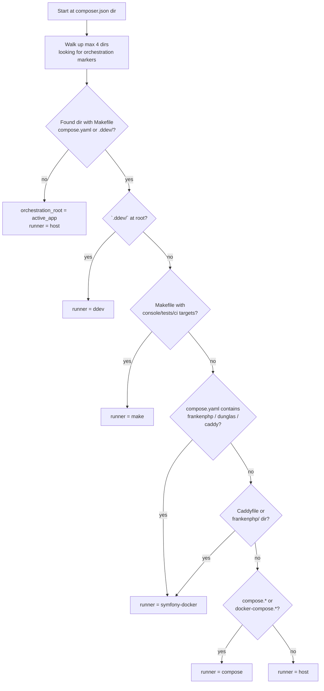

# Runner selection — reference

> Companion to `SKILL.md`. The canonical detection lives in `hooks/session-start.sh`. This document covers the manual cases + edge cases.

## Detection priority order



Make is **above** Symfony Docker in priority because when a Make wrapper exists with the right targets, it already knows the project's `COMPOSE_FILE`, env files, and service-naming conventions. Calling `docker compose exec php` directly may skip that wiring (wrong env, services not yet built, etc.).

## Prefix table

| Runner | bin/console | composer | phpunit | paratest |
|---|---|---|---|---|
| `host` | `php bin/console` | `composer` | `./vendor/bin/phpunit` | `./vendor/bin/paratest` |
| `ddev` | `ddev exec bin/console` | `ddev composer` | `ddev exec ./vendor/bin/phpunit` | `ddev exec ./vendor/bin/paratest` |
| `make` | `make console <args>` | `make composer <args>` | `make tests` (or `make test`) | (via `make tests`) |
| `symfony-docker` (FrankenPHP) | `docker compose exec php bin/console` | `docker compose exec php composer` | `docker compose exec php ./vendor/bin/phpunit` | `docker compose exec php ./vendor/bin/paratest` |
| `compose` (generic) | `docker compose exec <service> bin/console` | `docker compose exec <service> composer` | `docker compose exec <service> ./vendor/bin/phpunit` | `docker compose exec <service> ./vendor/bin/paratest` |

For the generic Compose case, **detect the service name**: run `docker compose config --services` and pick `php`, `app`, or the first PHP-running service.

For `make`, also expose any additional canonical targets the hook discovered: `make ci`, `make quality`, `make migrations`, `make migrations-diff`, `make fixtures-load`, etc. The list lives in `commands.*` plus `makefile.targets` in the hook JSON.

## Monorepo walking

For projects where `composer.json` lives in a sub-dir (`app/`, `symfony/`, `backend/`, etc.) but the orchestration files (Makefile / compose.yaml / .ddev) live at the repo root:

```
samurai/                          ← orchestration_root
├── Makefile                       ← detected
├── Makefile-solution
├── docker-compose.yml
├── docker/postgres/Makefile       ← included via include $(DOCKER_DIR)/$(1)/Makefile
├── docker/php/docker-compose.yml  ← aggregated via COMPOSE_FILE
└── symfony/                       ← active_app
    └── composer.json              ← starting point
```

The hook walks **up** from `active_app` (max 4 levels, stops at `.git/`) and uses the first dir matching the orchestration markers. From there:
- `docker compose ps` is run with that dir as CWD (so it sees the right `COMPOSE_FILE`).
- `make <target>` is invoked from that dir (Make already knows the includes).

If your project's Symfony app is deeper than 4 parent dirs from the orchestration root, set the convention in the project's CLAUDE.md — the hook's walk depth is intentionally conservative.

## Makefile-driven projects

When `runner_type == "make"` the hook chooses Make as canonical. Two flavors:

### Flat Makefile
Single `Makefile` at the root with all targets. The hook emits `make console`, `make tests`, etc.

### Boilerplate split (Smile pattern)
- `Makefile` = framework file, regenerated/updated by the boilerplate version — **do not edit**.
- `Makefile-solution` = project-specific targets — this is where you add custom workflows.
- `docker/<service>/Makefile` = per-service targets, rarely edited.

The hook detects this via:
- presence of `Makefile-solution` alongside `Makefile`,
- presence of `boilerplate_recipe.yml` at the root, or
- presence of `BOILERPLATE_VERSION=...` in `conf/.env.global`.

When detected, the hook emits a warning that custom targets must go in `Makefile-solution`. See sister skill `gerard:makefile-discipline` for the editing conventions.

### Discovering available targets

The hook exposes the full list as `makefile.targets` in the JSON output. From the shell:

```bash
make -pRrq 2>/dev/null \
  | awk '/^[a-zA-Z][a-zA-Z0-9_-]+:[^=]*$/ { sub(/:.*/, "", $1); print $1 }' \
  | sort -u
```

`make -pRrq` runs in "question" mode (no execution) and dumps the full database — that's what the hook does internally.

## Edge cases

### FrankenPHP worker mode (production)

In worker mode, the kernel stays in memory between requests. Run `bin/console cache:clear` after deploying or changing config (worker won't pick it up otherwise).

```bash
docker compose exec php php bin/console cache:clear --env=prod
```

For tests in CI, FrankenPHP runs in non-worker mode by default — same prefix as Symfony Docker dev.

### DDEV custom commands

DDEV exposes `ddev` shorthand commands. Prefer `ddev composer` over `ddev exec composer` (DDEV strips wrapper overhead for known commands). For `bin/console`, use `ddev exec` (no shorthand).

### Override files

If a `compose.override.yaml` (or `.yml`) exists, **do not assume** it shares the same service names as `compose.yaml`. Run `docker compose config` to merge and inspect the final config.

### `compose.yaml` present but no service running

The hook outputs `docker.running: false`. Workflow:

```bash
# Make-driven
make up

# Symfony Docker
docker compose up -d --wait

# DDEV
ddev start

# Generic compose
docker compose up -d
```

After services are up, re-run the failing command.

### Multi-PHP-version monorepos

If the repo has several `composer.json` files (one per app), `cd` to the app root before running. The session hook detects the **active app** (the closest `composer.json` containing `symfony/framework-bundle`) and uses it for the Symfony-side fields, while `orchestration_root` is the common parent for Docker/Make.

### `make console <multi-word command>` fails

Some Make conventions parse extra args via `MAKECMDGOALS` and forward them to the underlying `bin/console`. Quirky multi-word args (with spaces, options, etc.) may break the parser. The samurai CLAUDE.md documents a direct `docker compose exec` fallback for these cases. When the hook detects Make, **prefer `make console` for simple commands** but document the fallback for complex invocations.

## Mapping to session hook output

The hook produces JSON with these fields:

```json
{
  "orchestration_root": "/path/to/repo",
  "active_app": "/path/to/repo/symfony",
  "active_app_relative": "symfony",
  "docker": {
    "type": "ddev | symfony-docker | compose-yaml | compose-yml | docker-compose-yaml | docker-compose-yml | none",
    "running": true | false,
    "is_symfony_docker": true | false
  },
  "makefile": {
    "present": true | false,
    "primary": "Makefile" | "makefile" | null,
    "solution_file": "Makefile-solution" | null,
    "is_boilerplate_smile": true | false,
    "targets": ["help", "up", "down", "console", "tests", "ci", ...]
  },
  "commands": {
    "runner_type": "host | ddev | make | symfony-docker | compose",
    "runner":      "<prefix>",
    "console":     "<prefix> bin/console",
    "composer":    "<prefix> composer",
    "test":        "<prefix> ./vendor/bin/phpunit",
    "ci":          "make ci" | null,
    "quality":     "make quality" | null,
    "migrations":  "make migrations" | null
  },
  "guidance": "Start services with: make up" | null
}
```

Agents and skills that need to run a shell command read `commands.console` etc. and prepend it directly. No re-detection needed unless the hook didn't run (very old repos with custom CLAUDE.md that overrides hook discovery).

## Anti-patterns

- ❌ Hard-coding `docker compose exec php` in skill examples — not portable across DDEV / Make / host users
- ❌ Running `composer install` directly on host when the project uses Docker for php-fpm — local PHP version may not match
- ❌ Forgetting to `cd app/` in multi-app monorepos
- ❌ Using `docker exec` (without `compose`) — bypasses Compose service resolution
- ❌ Ignoring `make <target>` when it exists and reaching for `docker compose exec` instead — the Make target encodes the project's COMPOSE_FILE / env-file / service-name wiring
- ❌ Adding a custom target to `Makefile` when `Makefile-solution` exists — the boilerplate Makefile gets regenerated; your target disappears at the next bump

## References

- `docs/symfony/pipeline-overview.md` — agents that read the runner prefix
- `hooks/session-start.sh` — canonical detection logic
- `gerard:makefile-discipline` — sister skill for projects driven by Make
